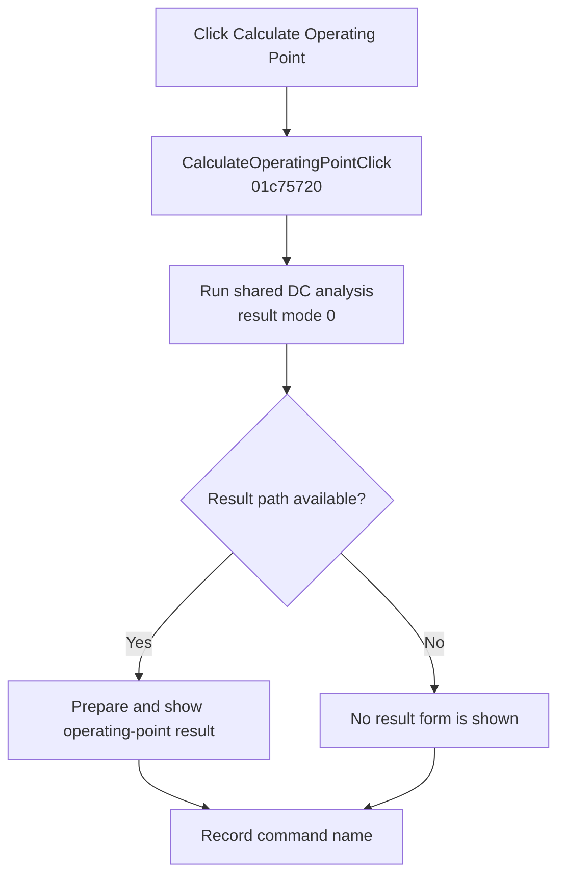

# &Calculate nodal voltages

> Analysis status: Complete. The handler selects the DC operating-point result path and records the command after the analysis call returns.

## Control

| Property | Recovered value |
| --- | --- |
| Form | SchematicEditor |
| Component path | SchematicEditor.MainMenu.mnAnalysis.DCAnalysis.CalculateOperatingPoint |
| Control class | TMenuItem |
| Caption | &Calculate nodal voltages |
| Hint | Not present in the recovered resource. |
| Text | Not present in the recovered resource. |
| Handler name | CalculateOperatingPointClick |
| Handler address | 01c75720 |
| Graph node | `resource:dfm:SchematicEditor/SchematicEditor.MainMenu.mnAnalysis.DCAnalysis.CalculateOperatingPoint` |
| Handler node | `function:01c75720` |
| Graph layer | UI |

## What happens when clicked

`FUN_01c75720` passes the active schematic model to `FUN_01320bb0` with the recovered DC selector and result-display mode `0`. The shared analysis routine builds and runs the DC analysis. Its mode-0 result path prepares the calculated result and can create and show the nodal-voltage result form.

After the shared routine returns, the handler records `CalculateOperatingPointClick` in the form's last-command string. The handler does not inspect the analysis return value and has no local retry or error branch.

## Click flow

## Handler evidence

- Source: [DecompiledSources/Tina16/functions/0000000001C75720__FUN_01c75720.c](../../../DecompiledSources/Tina16/functions/0000000001C75720__FUN_01c75720.c)
- Recovered role: Runs the DC operating-point path for the active schematic.
- Current graph summary: Handles 1 Delphi UI event: SchematicEditor.MainMenu.mnAnalysis.DCAnalysis.CalculateOperatingPoint.OnClick.
- Current graph behavior: Calls the shared DC analysis with result mode 0, lets that routine prepare and show the operating-point result when available, and then records the command name.
- Current graph evidence: `FUN_01c75720` supplies the model at `+0x2788`, selector 0, display mode 0, and resource code `0x1c7` to `FUN_01320bb0`. The shared routine passes display mode 0 to `FUN_0131f8d0`, whose mode-0 branch builds and shows the recovered result form.
- Complexity: moderate
- Distinct outgoing calls: 2

## Direct calls

- `function:00414ad0` — Records the command name in the form string
- `function:01320bb0` — Builds, runs, and publishes the shared DC analysis

## Resource evidence

- Kind: Not present in the recovered resource.
- Modal result: Not present in the recovered resource.
- Checked state: Not present in the recovered resource.
- List items: Not present in the recovered resource.
- Image reference: Not present in the recovered resource.
- Extracted glyph: None.

## Nearby label candidates

Nearby labels are layout candidates only. They are not proof of behavior.

- No same-parent label candidate is available.

## Analysis limits

- The handler does not expose the meanings of nonzero internal solver states.
- Analysis exceptions and cleanup are owned by `FUN_01320bb0`; the wrapper has no local recovery.
