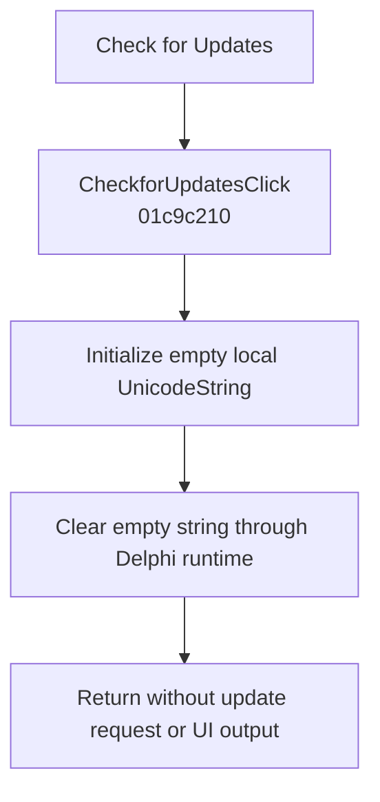

# Check for Updates...

> Analysis status: Evidence-backed no-op recovered.

## Control

| Property | Recovered value |
| --- | --- |
| Form | SchematicEditor |
| Component path | SchematicEditor.MainMenu.Help.CheckforUpdates |
| Control class | TMenuItem |
| Caption | Check for Updates... |
| Hint | Not present in the recovered resource. |
| Text | Not present in the recovered resource. |
| Handler name | CheckforUpdatesClick |
| Handler address | 01c9c210 |
| Graph node | `resource:dfm:SchematicEditor/SchematicEditor.MainMenu.Help.CheckforUpdates` |
| Handler node | `function:01c9c210` |
| Graph layer | UI |

## What happens when clicked

The handler initializes a local UnicodeString slot to zero, calls the Delphi `@UStrClr` runtime helper on that empty slot, and returns. It has no network, process, file, dialog, browser, or application call. Therefore, this recovered build performs no update check and produces no visible output for this click.

## Click flow

## Handler evidence

- Source: [DecompiledSources/Tina16/functions/0000000001C9C210__FUN_01c9c210.c](../../../DecompiledSources/Tina16/functions/0000000001C9C210__FUN_01c9c210.c)
- Recovered role: No-op update-check handler in the recovered build.
- Current graph summary: Handles 1 Delphi UI event: SchematicEditor.MainMenu.Help.CheckforUpdates.OnClick.
- Current graph behavior: The handler clears an empty local string and returns without application work.
- Current graph evidence: The recovered body contains only local zero initialization and `FUN_00414480`, the annotated Delphi UnicodeString clear helper. The graph has no other outgoing call.
- Complexity: simple
- Distinct outgoing calls: 1

## Direct calls

- `function:00414480` — Delphi UnicodeString clear and finalization helper

## Resource evidence

- Kind: Not present in the recovered resource.
- Modal result: Not present in the recovered resource.
- Checked state: Not present in the recovered resource.
- List items: Not present in the recovered resource.
- Image reference: Not present in the recovered resource.
- Extracted glyph: None.

## Nearby label candidates

Nearby labels are layout candidates only. They are not proof of behavior.

- No same-parent label candidate is available.

## Analysis limits

- The no-op result applies to this recovered runtime. No inactive update implementation is reachable from this handler.

