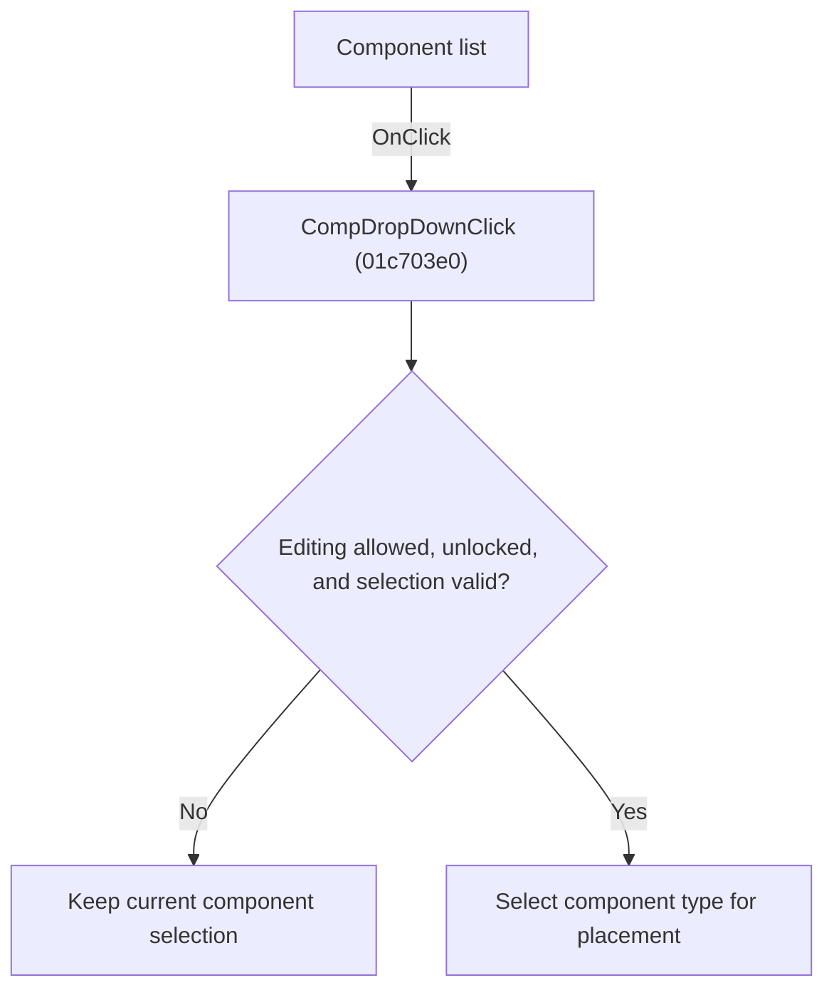

# Component list

> Analysis status: Individually reviewed.

## Control

| Property | Recovered value |
| --- | --- |
| Form | SchematicEditor |
| Component path | SchematicEditor.TopToolBar.CompDropDownP.CompDropDown |
| Control class | TComboBox |
| Caption | Not present in the recovered resource. |
| Hint | Component list |
| Text | Not present in the recovered resource. |
| Handler name | CompDropDownClick |
| Handler address | 01c703e0 |
| Graph node | `resource:dfm:SchematicEditor/SchematicEditor.TopToolBar.CompDropDownP.CompDropDown` |
| Handler node | `function:01c703e0` |
| Graph layer | UI |

## What happens when clicked

If editing is allowed and the schematic is not locked, the handler reads the dropdown component index. It selects that component type for placement when the index is valid; index -1 or a failed guard causes no selection change.

## Click flow

## Handler evidence

- Source: [DecompiledSources/Tina16/functions/0000000001C703E0__FUN_01c703e0.c](../../../DecompiledSources/Tina16/functions/0000000001C703E0__FUN_01c703e0.c)
- Recovered role: Select a component from the component dropdown.
- Current graph summary: Handles 1 Delphi UI event: SchematicEditor.TopToolBar.CompDropDownP.CompDropDown.OnClick.
- Current graph behavior: If editing is allowed and the schematic is not locked, the handler reads the dropdown component index. It selects that component type for placement when the index is valid; index -1 or a failed guard causes no selection change.
- Current graph evidence: The recovered body checks the common permission and lock conditions, resolves the dropdown selection through FUN_01c702c0, tests it against -1, and passes a valid index to FUN_01c6ec30.
- Complexity: complex
- Distinct outgoing calls: 3

## Direct calls

- `function:01c6ec30` — FUN_01c6ec30
- `function:01c6ff00` — FUN_01c6ff00
- `function:01c8cee0` — FUN_01c8cee0

## Resource evidence

- Kind: Not present in the recovered resource.
- Modal result: Not present in the recovered resource.
- Checked state: Not present in the recovered resource.
- List items: Not present in the recovered resource.
- Image reference: Not present in the recovered resource.
- Extracted glyph: None.

## Nearby label candidates

Nearby labels are layout candidates only. They are not proof of behavior.

- No same-parent label candidate is available.

## Analysis limits

- The selected component identity depends on the runtime dropdown entry.

