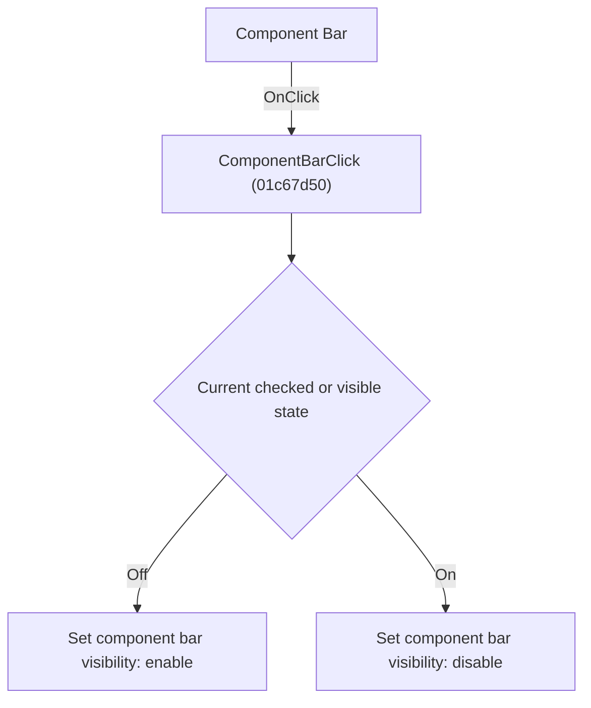

# Component Bar

> Analysis status: Individually reviewed.

## Control

| Property | Recovered value |
| --- | --- |
| Form | SchematicEditor |
| Component path | SchematicEditor.ToolsPopup.ComponentBar |
| Control class | TMenuItem |
| Caption | Component Bar |
| Hint | Not present in the recovered resource. |
| Text | Not present in the recovered resource. |
| Handler name | ComponentBarClick |
| Handler address | 01c67d50 |
| Graph node | `resource:dfm:SchematicEditor/SchematicEditor.ToolsPopup.ComponentBar` |
| Handler node | `function:01c67d50` |
| Graph layer | UI |

## What happens when clicked

The handler reads the current component-panel visibility and applies the opposite value. If the toolbar is visible, it temporarily hides and restores the toolbar around the layout change so the toolbar keeps its original final state.

## Click flow

## Handler evidence

- Source: [DecompiledSources/Tina16/functions/0000000001C67D50__FUN_01c67d50.c](../../../DecompiledSources/Tina16/functions/0000000001C67D50__FUN_01c67d50.c)
- Recovered role: Toggle the component bar.
- Current graph summary: Handles 1 Delphi UI event: SchematicEditor.ToolsPopup.ComponentBar.OnClick.
- Current graph behavior: The handler reads the current component-panel visibility and applies the opposite value. If the toolbar is visible, it temporarily hides and restores the toolbar around the layout change so the toolbar keeps its original final state.
- Current graph evidence: The recovered body reads the component panel visible byte, negates it, and calls FUN_01c679d0. Its second branch preserves the toolbar visible byte around that call. The ToolsPopup.ComponentBar resource supplies the Component Bar caption.
- Complexity: simple
- Distinct outgoing calls: 1

## Direct calls

- `function:0064dbe0` — FUN_0064dbe0

## Resource evidence

- Kind: Not present in the recovered resource.
- Modal result: Not present in the recovered resource.
- Checked state: true
- List items: Not present in the recovered resource.
- Image reference: Not present in the recovered resource.
- Extracted glyph: None.

## Nearby label candidates

Nearby labels are layout candidates only. They are not proof of behavior.

- No same-parent label candidate is available.

## Analysis limits

- The recovered field names are unavailable; the component and toolbar identities come from the DFM bindings and the paired visibility paths.

