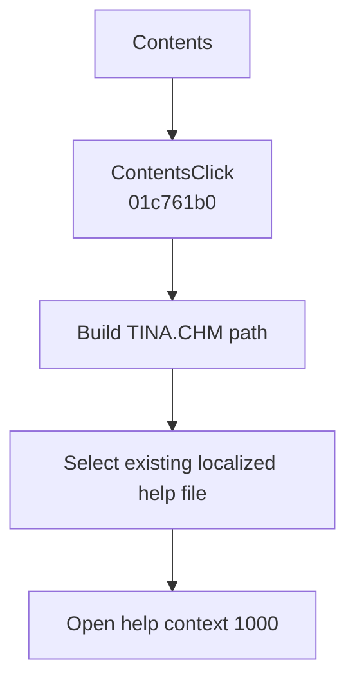

# &Contents

> Analysis status: Evidence-backed behavior recovered.

## Control

| Property | Recovered value |
| --- | --- |
| Form | SchematicEditor |
| Component path | SchematicEditor.MainMenu.Help.Contents |
| Control class | TMenuItem |
| Caption | &Contents |
| Hint | Not present in the recovered resource. |
| Text | Not present in the recovered resource. |
| Handler name | ContentsClick |
| Handler address | 01c761b0 |
| Graph node | `resource:dfm:SchematicEditor/SchematicEditor.MainMenu.Help.Contents` |
| Handler node | `function:01c761b0` |
| Graph layer | UI |

## What happens when clicked

The handler builds a path to `TINA.CHM` from the application help base, passes it to `FUN_01B1DEF0` to select an existing language-specific help-file variant, and calls the application help-system method at virtual offset `0x20` with context ID 1000. It does not change the schematic model. Failure behavior for a missing help file belongs to the VCL help system and is not present in this handler.

## Click flow

## Handler evidence

- Source: [DecompiledSources/Tina16/functions/0000000001C761B0__FUN_01c761b0.c](../../../DecompiledSources/Tina16/functions/0000000001C761B0__FUN_01c761b0.c)
- Recovered role: Opens TINA help context 1000 from the localized help file.
- Current graph summary: Handles 1 Delphi UI event: SchematicEditor.MainMenu.Help.Contents.OnClick.
- Current graph behavior: The handler resolves a localized `TINA.CHM` and invokes the help system with numeric context 1000.
- Current graph evidence: The file literal, `FUN_01B1DEF0` localization helper, virtual help call, and context ID are direct recovered source values.
- Complexity: complex
- Distinct outgoing calls: 3

## Direct calls

- `function:00414560` — Delphi UnicodeString array finalization helper
- `function:00416cd0` — FUN_00416cd0
- `function:01b1def0` — FUN_01b1def0

## Resource evidence

- Kind: Not present in the recovered resource.
- Modal result: Not present in the recovered resource.
- Checked state: Not present in the recovered resource.
- List items: Not present in the recovered resource.
- Image reference: Not present in the recovered resource.
- Extracted glyph: None.

## Nearby label candidates

Nearby labels are layout candidates only. They are not proof of behavior.

- No same-parent label candidate is available.

## Analysis limits

- The recovered source does not show the VCL message shown when the help file is absent.

