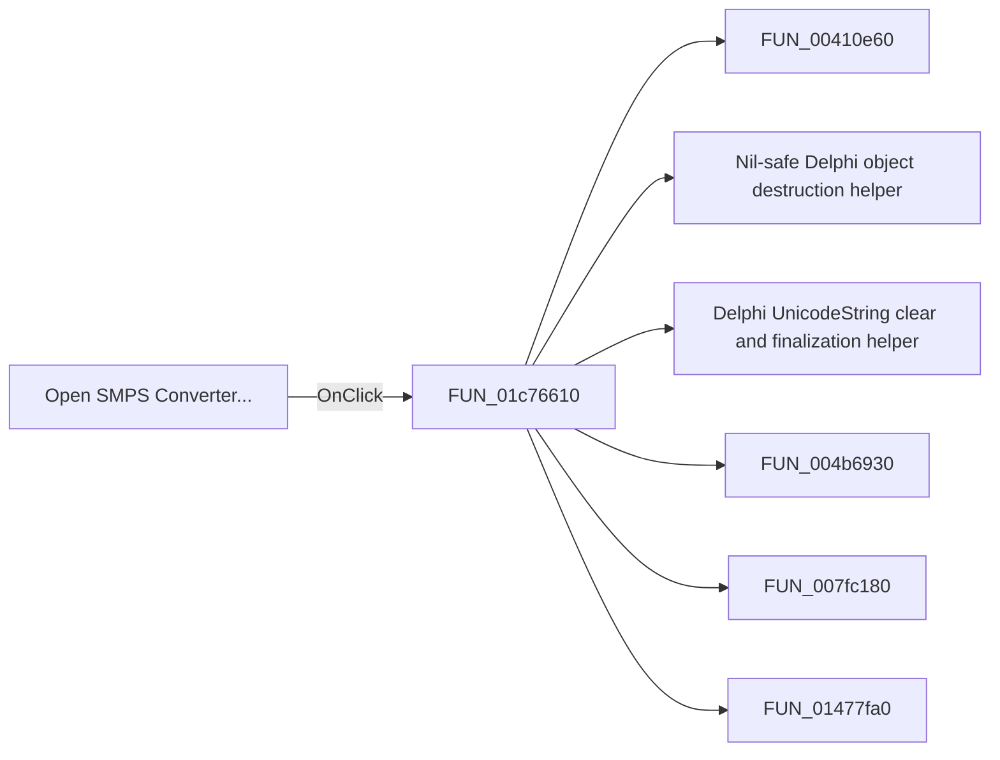

# Open SMPS Converter...

> Analysis status: Pending individual source review.

## Control

| Property | Recovered value |
| --- | --- |
| Form | SchematicEditor |
| Component path | SchematicEditor.MainMenu.mnFile.ConvertersMnu |
| Control class | TMenuItem |
| Caption | Open SMPS Converter... |
| Hint | Not present in the recovered resource. |
| Text | Not present in the recovered resource. |
| Handler name | ConvertersMnuClick |
| Handler address | 01c76610 |
| Graph node | `resource:dfm:SchematicEditor/SchematicEditor.MainMenu.mnFile.ConvertersMnu` |
| Handler node | `function:01c76610` |
| Graph layer | UI |

## What happens when clicked

Pending individual analysis. An agent must read the recovered handler source and its relevant callees before it replaces this text.

## Click flow

## Handler evidence

- Source: [DecompiledSources/Tina16/functions/0000000001C76610__FUN_01c76610.c](../../../DecompiledSources/Tina16/functions/0000000001C76610__FUN_01c76610.c)
- Recovered role: Not present in the recovered resource.
- Current graph summary: Handles 1 Delphi UI event: SchematicEditor.MainMenu.mnFile.ConvertersMnu.OnClick.
- Current graph behavior: Not present in the recovered resource.
- Current graph evidence: Not present in the recovered resource.
- Complexity: complex
- Distinct outgoing calls: 12

## Direct calls

- `function:00410e60` — FUN_00410e60
- `function:00410f20` — Nil-safe Delphi object destruction helper
- `function:00414480` — Delphi UnicodeString clear and finalization helper
- `function:004b6930` — FUN_004b6930
- `function:007fc180` — FUN_007fc180
- `function:01477fa0` — FUN_01477fa0
- `function:01478670` — FUN_01478670
- `function:01479a90` — FUN_01479a90
- `function:019a4600` — FUN_019a4600
- `function:01c4c580` — FUN_01c4c580
- `function:01c681b0` — FUN_01c681b0
- `function:01c76fd0` — Handles 1 Delphi UI event: SchematicEditor.MainMenu.View.mnRedraw.OnClick.

## Resource evidence

- Kind: Not present in the recovered resource.
- Modal result: Not present in the recovered resource.
- Checked state: Not present in the recovered resource.
- List items: Not present in the recovered resource.
- Image reference: Not present in the recovered resource.
- Extracted glyph: None.

## Nearby label candidates

Nearby labels are layout candidates only. They are not proof of behavior.

- No same-parent label candidate is available.

## Analysis limits

- Do not infer behavior from the control class, caption, hint, glyph, or nearby label alone.
- Do not replace the pending status until the handler source and relevant call path provide enough evidence.
