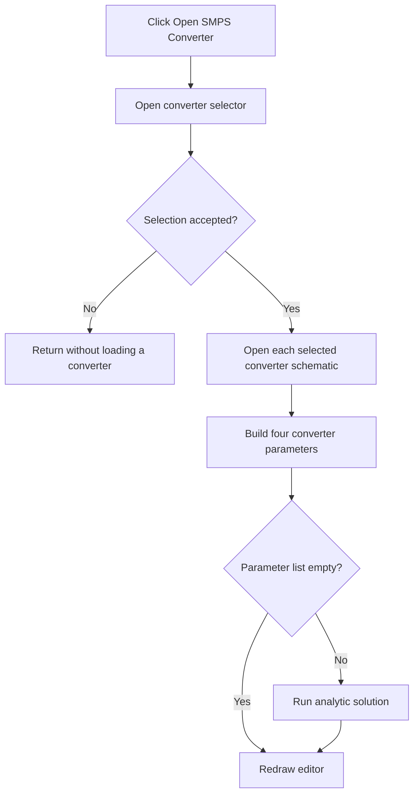

# Open SMPS Converter...

> Analysis status: Reviewed from the converter dialog, example-loader, and analytic-runner paths.

## Control

| Property | Recovered value |
| --- | --- |
| Form | SchematicEditor |
| Component path | SchematicEditor.MainMenu.mnFile.ConvertersMnu |
| Control class | TMenuItem |
| Caption | Open SMPS Converter... |
| Hint | Not present in the recovered resource. |
| Text | Not present in the recovered resource. |
| Handler name | ConvertersMnuClick |
| Handler address | 01c76610 |
| Graph node | `resource:dfm:SchematicEditor/SchematicEditor.MainMenu.mnFile.ConvertersMnu` |
| Handler node | `function:01c76610` |
| Graph layer | UI |

## What happens when clicked

The handler opens `ConvertersDlg`. The dialog validates the selected converter examples under the TINA Examples directory. If the converter add-on is absent, it can offer to open the converter add-on download URL. After an accepted selection, the handler opens each selected converter schematic. It builds `V_in`, `V_out`, `I_out`, and `F_sw` parameter assignments from the dialog values, gives them to the analytic runner, and runs the solution when the parameter list is not empty. It redraws the editor after it processes the selected converters.

## Click flow

## Handler evidence

- Source: [DecompiledSources/Tina16/functions/0000000001C76610__FUN_01c76610.c](../../../DecompiledSources/Tina16/functions/0000000001C76610__FUN_01c76610.c)
- Recovered role: Open selected SMPS converter examples and run their parameterized analytic solutions.
- Current graph summary: Handles 1 Delphi UI event: SchematicEditor.MainMenu.mnFile.ConvertersMnu.OnClick.
- Current graph behavior: Shows the converter selector, loads selected examples, injects converter parameter values, runs the analytic solution, and redraws the editor.
- Current graph evidence: `FUN_01c76610` creates `ConvertersDlg`, loops its selected paths after modal acceptance, opens each through `FUN_01c681b0`, and calls `FUN_01c4c580`. That helper formats `V_in=`, `V_out=`, `I_out=`, and `F_sw=` values. The handler creates the runner through `FUN_01477fa0`, passes the list through `FUN_01479a90`, runs `FUN_01478670` for a nonempty list, and calls the recovered Redraw handler at `01c76fd0`.
- Complexity: complex
- Distinct outgoing calls: 12

## Direct calls

- `function:00410e60` — FUN_00410e60
- `function:00410f20` — Nil-safe Delphi object destruction helper
- `function:00414480` — Delphi UnicodeString clear and finalization helper
- `function:004b6930` — FUN_004b6930
- `function:007fc180` — FUN_007fc180
- `function:01477fa0` — FUN_01477fa0
- `function:01478670` — FUN_01478670
- `function:01479a90` — FUN_01479a90
- `function:019a4600` — FUN_019a4600
- `function:01c4c580` — FUN_01c4c580
- `function:01c681b0` — FUN_01c681b0
- `function:01c76fd0` — Handles 1 Delphi UI event: SchematicEditor.MainMenu.View.mnRedraw.OnClick.

## Resource evidence

- Kind: Not present in the recovered resource.
- Modal result: Not present in the recovered resource.
- Checked state: Not present in the recovered resource.
- List items: Not present in the recovered resource.
- Image reference: Not present in the recovered resource.
- Extracted glyph: None.

## Nearby label candidates

Nearby labels are layout candidates only. They are not proof of behavior.

- No same-parent label candidate is available.

## Analysis limits

- The recovered source does not expose a Delphi class name for the analytic runner.
- The add-on download opens only from the dialog's validation path, not directly from this menu handler.

