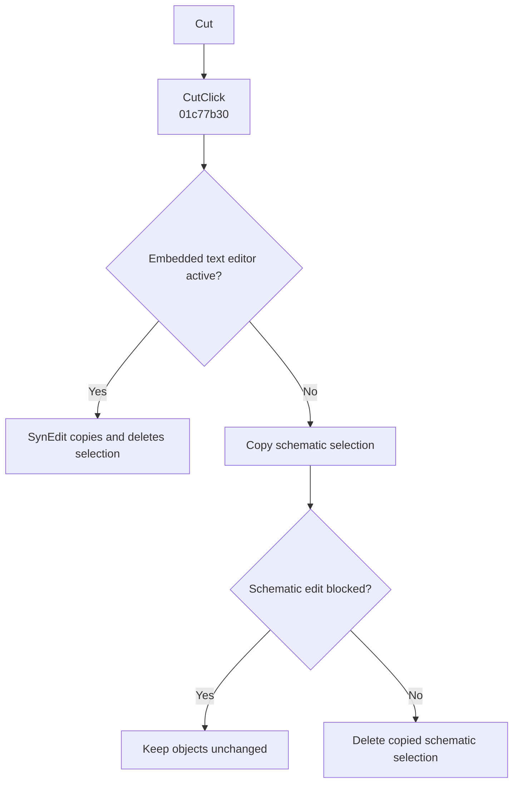

# Cu&t

> Analysis status: Evidence-backed behavior recovered.

## Control

| Property | Recovered value |
| --- | --- |
| Form | SchematicEditor |
| Component path | SchematicEditor.MainMenu.Edit.Cut |
| Control class | TMenuItem |
| Caption | Cu&t |
| Hint | Not present in the recovered resource. |
| Text | Not present in the recovered resource. |
| Handler name | CutClick |
| Handler address | 01c77b30 |
| Graph node | `resource:dfm:SchematicEditor/SchematicEditor.MainMenu.Edit.Cut` |
| Handler node | `function:01c77b30` |
| Graph layer | UI |

## What happens when clicked

The handler has two proven target modes. When an active embedded text editor has mode value 3 or 4, it calls the recovered SynEdit `CutToClipboard` path. That path copies a nonempty editable selection and deletes it as one undoable edit. Otherwise, the handler first calls the schematic Copy path. If the shared edit guard then permits a change, it calls the schematic Delete path. A blocked edit keeps the copied data but does not delete schematic objects.

## Click flow

## Handler evidence

- Source: [DecompiledSources/Tina16/functions/0000000001C77B30__FUN_01c77b30.c](../../../DecompiledSources/Tina16/functions/0000000001C77B30__FUN_01c77b30.c)
- Recovered role: Cuts either an embedded text selection or the selected schematic objects.
- Current graph summary: Handles 1 Delphi UI event: SchematicEditor.MainMenu.Edit.Cut.OnClick.
- Current graph behavior: Text mode uses `TCustomSynEdit.CutToClipboard`; schematic mode calls Copy before the guarded Delete path.
- Current graph evidence: The handler tests the active editor mode and global editor pointer. `FUN_01C77BB0` supplies Copy, `FUN_01C76C90` supplies schematic Delete, and `FUN_00BF1E50` is the annotated SynEdit cut helper.
- Complexity: complex
- Distinct outgoing calls: 4

## Direct calls

- `function:00bf1e50` — FUN_00bf1e50
- `function:01c76c90` — Handles 3 Delphi UI events: SchematicEditor.TopToolBar.EditorTools.ToolDelete.OnClick, SchematicEditor.MainMenu.Edit.mnDelete.OnClick, SchematicEditor.SchPopup.pmDelete.OnClick.
- `function:01c77bb0` — Handles 2 Delphi UI events: SchematicEditor.TopToolBar.GeneralTools.DFCopyBtn.OnClick, SchematicEditor.MainMenu.Edit.Copy.OnClick.
- `function:01c8cee0` — FUN_01c8cee0

## Resource evidence

- Kind: Not present in the recovered resource.
- Modal result: Not present in the recovered resource.
- Checked state: Not present in the recovered resource.
- List items: Not present in the recovered resource.
- Image reference: Not present in the recovered resource.
- Extracted glyph: None.

## Nearby label candidates

Nearby labels are layout candidates only. They are not proof of behavior.

- No same-parent label candidate is available.

## Analysis limits

- Clipboard-format details for schematic objects are outside this handler. The target branch, copy-before-delete order, and no-op guards are proven.

