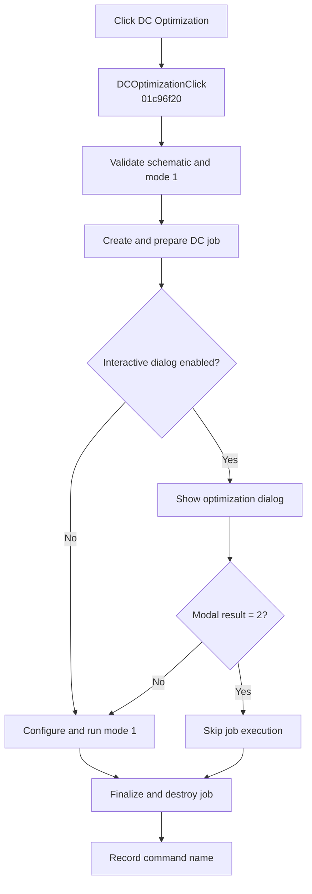

# &DC Optimization...

> Analysis status: Complete. The handler prepares interactive DC optimization mode 1 and honors modal cancellation.

## Control

| Property | Recovered value |
| --- | --- |
| Form | SchematicEditor |
| Component path | SchematicEditor.MainMenu.mnAnalysis.Optimization.DCOptimization |
| Control class | TMenuItem |
| Caption | &DC Optimization... |
| Hint | Not present in the recovered resource. |
| Text | Not present in the recovered resource. |
| Handler name | DCOptimizationClick |
| Handler address | 01c96f20 |
| Graph node | `resource:dfm:SchematicEditor/SchematicEditor.MainMenu.mnAnalysis.Optimization.DCOptimization` |
| Handler node | `function:01c96f20` |
| Graph layer | UI |

## What happens when clicked

`FUN_01c96f20` calls `FUN_01373b60` with the active schematic and interactive selector `0`. The shared routine verifies that two required schematic collections are not empty and that optimization mode `1` is available. It creates the DC optimization job and prepares mode `1`.

When interactive dialogs are enabled by the recovered global flag, the routine shows the shared optimization dialog. Modal result `2` skips job configuration and execution. Otherwise, it configures the mode-1 job, runs its finalization path, releases associated result state, and destroys the job. The handler records `DCOptimizationClick` after the shared routine returns, including after Cancel.

## Click flow

## Handler evidence

- Source: [DecompiledSources/Tina16/functions/0000000001C96F20__FUN_01c96f20.c](../../../DecompiledSources/Tina16/functions/0000000001C96F20__FUN_01c96f20.c)
- Recovered role: Runs the interactive DC optimization mode-1 path.
- Current graph summary: Handles 1 Delphi UI event: SchematicEditor.MainMenu.mnAnalysis.Optimization.DCOptimization.OnClick.
- Current graph behavior: Validates the schematic, prepares a DC optimization job, honors modal cancellation, otherwise configures and runs mode 1, then cleans up and records the command.
- Current graph evidence: `FUN_01c96f20` passes the active model and selector 0 to `FUN_01373b60`. That callee checks the required collections and capability mode 1, prepares the job, conditionally shows the shared modal dialog, tests result 2, and only then calls the mode-1 configure and finalize sequence before cleanup.
- Complexity: moderate
- Distinct outgoing calls: 2

## Direct calls

- `function:00414ad0` — Records the command name
- `function:01373b60` — Validates, prepares, optionally prompts, and runs DC optimization mode 1

## Resource evidence

- Kind: Not present in the recovered resource.
- Modal result: Not present in the recovered resource.
- Checked state: Not present in the recovered resource.
- List items: Not present in the recovered resource.
- Image reference: Not present in the recovered resource.
- Extracted glyph: None.

## Nearby label candidates

Nearby labels are layout candidates only. They are not proof of behavior.

- No same-parent label candidate is available.

## Analysis limits

- The semantic name of the global dialog-suppression byte is not recovered.
- The handler records its command name after both acceptance and cancellation.
- Internal optimizer convergence and failure codes are not returned to the wrapper.
