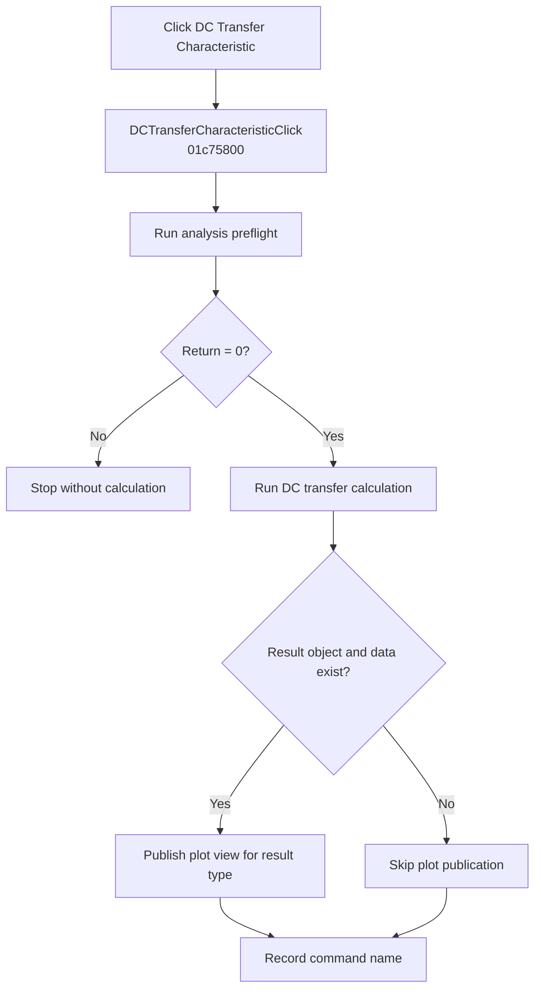

# &DC Transfer Characteristic...

> Analysis status: Complete. A zero preflight result runs DC transfer analysis and publishes its available plot result.

## Control

| Property | Recovered value |
| --- | --- |
| Form | SchematicEditor |
| Component path | SchematicEditor.MainMenu.mnAnalysis.DCAnalysis.DCTransferCharacteristic |
| Control class | TMenuItem |
| Caption | &DC Transfer Characteristic... |
| Hint | Not present in the recovered resource. |
| Text | Not present in the recovered resource. |
| Handler name | DCTransferCharacteristicClick |
| Handler address | 01c75800 |
| Graph node | `resource:dfm:SchematicEditor/SchematicEditor.MainMenu.mnAnalysis.DCAnalysis.DCTransferCharacteristic` |
| Handler node | `function:01c75800` |
| Graph layer | UI |

## What happens when clicked

`FUN_01c75800` first runs `FUN_01324990` for the active schematic. A nonzero return stops the handler without running the transfer calculation or recording the command.

For a zero return, the handler runs `FUN_013d3ef0` on the active circuit data with interactive flag `1`. That function performs the DC transfer calculation and registers its result. If the active result object and its data pointer exist, the handler passes its recovered type byte to `FUN_013c7550` to publish the applicable plot view. It then records `DCTransferCharacteristicClick`.

## Click flow

## Handler evidence

- Source: [DecompiledSources/Tina16/functions/0000000001C75800__FUN_01c75800.c](../../../DecompiledSources/Tina16/functions/0000000001C75800__FUN_01c75800.c)
- Recovered role: Runs and publishes DC transfer analysis after a successful preflight.
- Current graph summary: Handles 1 Delphi UI event: SchematicEditor.MainMenu.mnAnalysis.DCAnalysis.DCTransferCharacteristic.OnClick.
- Current graph behavior: Stops on a nonzero preflight result. Otherwise, runs DC transfer analysis, publishes an available typed plot result, and records the command.
- Current graph evidence: `FUN_01c75800` branches on `FUN_01324990`, calls the annotated DC-transfer runner `FUN_013d3ef0` only for zero, checks the active result and its `+8` data pointer, then calls the annotated plot publisher `FUN_013c7550` with the result type byte at `+0x434`.
- Complexity: complex
- Distinct outgoing calls: 4

## Direct calls

- `function:00414ad0` — Records the command name
- `function:01324990` — Prepares the analysis and returns a stop-or-continue status
- `function:013c7550` — Publishes the available typed plot result
- `function:013d3ef0` — Runs DC transfer analysis and registers its result

## Resource evidence

- Kind: Not present in the recovered resource.
- Modal result: Not present in the recovered resource.
- Checked state: Not present in the recovered resource.
- List items: Not present in the recovered resource.
- Image reference: Not present in the recovered resource.
- Extracted glyph: None.

## Nearby label candidates

Nearby labels are layout candidates only. They are not proof of behavior.

- No same-parent label candidate is available.

## Analysis limits

- The exact meanings of nonzero preflight results are not recovered.
- The handler has no local exception, retry, or rollback path.
