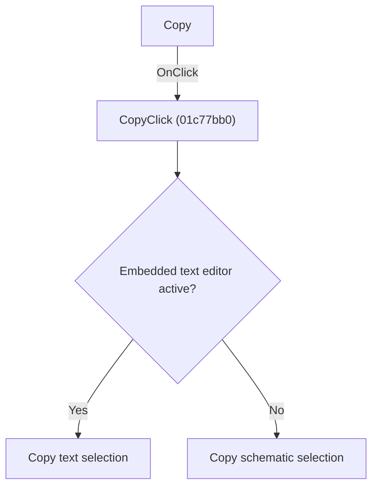

# Copy

> Analysis status: Individually reviewed.

## Control

| Property | Recovered value |
| --- | --- |
| Form | SchematicEditor |
| Component path | SchematicEditor.TopToolBar.GeneralTools.DFCopyBtn |
| Control class | TSpeedButton |
| Caption | Not present in the recovered resource. |
| Hint | Copy |
| Text | Not present in the recovered resource. |
| Handler name | CopyClick |
| Handler address | 01c77bb0 |
| Graph node | `resource:dfm:SchematicEditor/SchematicEditor.TopToolBar.GeneralTools.DFCopyBtn` |
| Handler node | `function:01c77bb0` |
| Graph layer | UI |

## What happens when clicked

If the embedded SynEdit context is active, the handler copies its text selection. Otherwise it copies the schematic selection. The menu and toolbar controls share the same context-based behavior.

## Click flow

## Handler evidence

- Source: [DecompiledSources/Tina16/functions/0000000001C77BB0__FUN_01c77bb0.c](../../../DecompiledSources/Tina16/functions/0000000001C77BB0__FUN_01c77bb0.c)
- Recovered role: Copy the active editor selection.
- Current graph summary: Handles 2 Delphi UI events: SchematicEditor.TopToolBar.GeneralTools.DFCopyBtn.OnClick, SchematicEditor.MainMenu.Edit.Copy.OnClick.
- Current graph behavior: If the embedded SynEdit context is active, the handler copies its text selection. Otherwise it copies the schematic selection. The menu and toolbar controls share the same context-based behavior.
- Current graph evidence: The recovered body tests the editor-mode field and either invokes the SynEdit copy method or the schematic-copy helper. Sender is not used.
- Complexity: moderate
- Distinct outgoing calls: 2

## Direct calls

- `function:00bf1d60` — FUN_00bf1d60
- `function:01b9b8a0` — FUN_01b9b8a0

## Resource evidence

- Kind: Not present in the recovered resource.
- Modal result: Not present in the recovered resource.
- Checked state: Not present in the recovered resource.
- List items: Not present in the recovered resource.
- Image reference: Not present in the recovered resource.
- Extracted glyph: [`0355_SchematicEditor_SchematicEditor_TopToolBar_GeneralTools_DFCopyBtn_Glyph_Data.png`](../../../glyph/0355_SchematicEditor_SchematicEditor_TopToolBar_GeneralTools_DFCopyBtn_Glyph_Data.png)

## Nearby label candidates

Nearby labels are layout candidates only. They are not proof of behavior.

- No same-parent label candidate is available.

## Analysis limits

- Clipboard formats produced by the schematic-copy helper were not expanded for this control.

