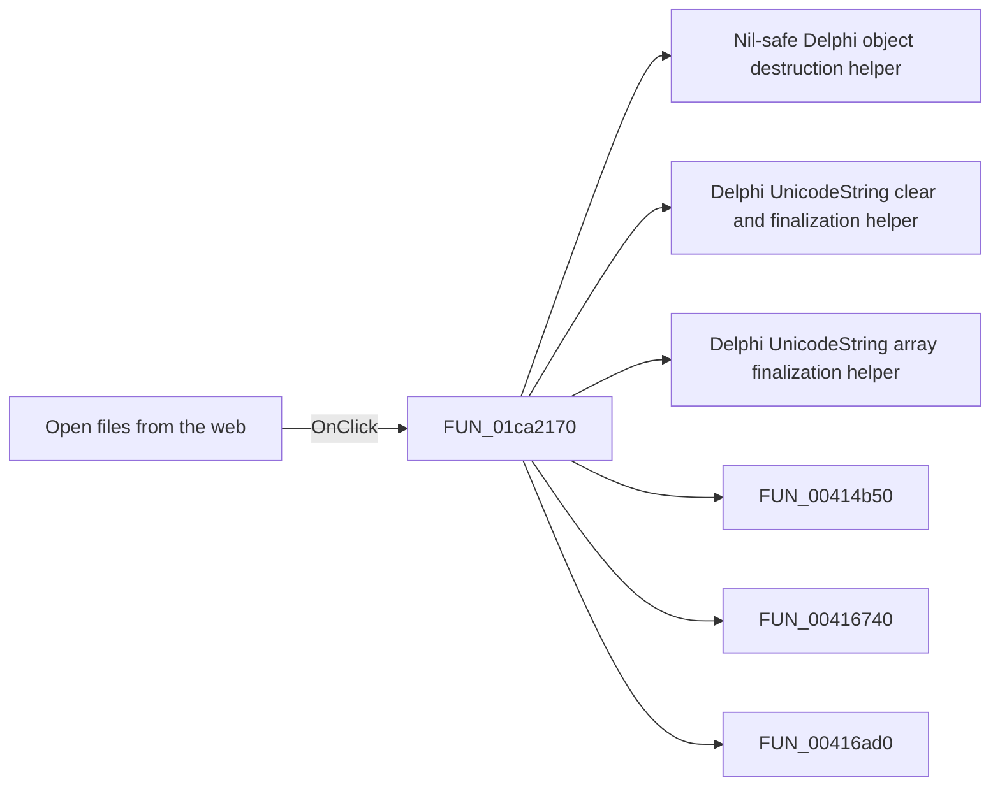

# Open files from the web

> Analysis status: Pending individual source review.

## Control

| Property | Recovered value |
| --- | --- |
| Form | SchematicEditor |
| Component path | SchematicEditor.TopToolBar.GeneralTools.DFOpenFromWebBtn |
| Control class | TSpeedButton |
| Caption | Not present in the recovered resource. |
| Hint | Open files from the web |
| Text | Not present in the recovered resource. |
| Handler name | mnOpenFileFromWebClick |
| Handler address | 01ca2170 |
| Graph node | `resource:dfm:SchematicEditor/SchematicEditor.TopToolBar.GeneralTools.DFOpenFromWebBtn` |
| Handler node | `function:01ca2170` |
| Graph layer | UI |

## What happens when clicked

Pending individual analysis. An agent must read the recovered handler source and its relevant callees before it replaces this text.

## Click flow

## Handler evidence

- Source: [DecompiledSources/Tina16/functions/0000000001CA2170__FUN_01ca2170.c](../../../DecompiledSources/Tina16/functions/0000000001CA2170__FUN_01ca2170.c)
- Recovered role: Not present in the recovered resource.
- Current graph summary: Handles 2 Delphi UI events: SchematicEditor.TopToolBar.GeneralTools.DFOpenFromWebBtn.OnClick, SchematicEditor.MainMenu.mnFile.mnOpenFileFromWeb.OnClick.
- Current graph behavior: Not present in the recovered resource.
- Current graph evidence: Not present in the recovered resource.
- Complexity: complex
- Distinct outgoing calls: 22

## Direct calls

- `function:00410f20` — Nil-safe Delphi object destruction helper
- `function:00414480` — Delphi UnicodeString clear and finalization helper
- `function:00414560` — Delphi UnicodeString array finalization helper
- `function:00414b50` — FUN_00414b50
- `function:00416740` — FUN_00416740
- `function:00416ad0` — FUN_00416ad0
- `function:00416ba0` — FUN_00416ba0
- `function:00416cd0` — FUN_00416cd0
- `function:0043e420` — FUN_0043e420
- `function:00441920` — FUN_00441920
- `function:00441a10` — FUN_00441a10
- `function:00442f70` — FUN_00442f70
- `function:00450070` — FUN_00450070
- `function:004b6930` — FUN_004b6930
- `function:00724270` — FUN_00724270
- `function:014a1260` — FUN_014a1260
- `function:01530bb0` — FUN_01530bb0
- `function:01542950` — FUN_01542950
- `function:0199e310` — FUN_0199e310
- `function:01c1de60` — FUN_01c1de60
- `function:01c681b0` — FUN_01c681b0
- `function:01c806a0` — Handles 1 Delphi UI event: SchematicEditor.MainMenu.mnTools.mnSPiceEditor.OnClick.

## Resource evidence

- Kind: Not present in the recovered resource.
- Modal result: Not present in the recovered resource.
- Checked state: Not present in the recovered resource.
- List items: Not present in the recovered resource.
- Image reference: Not present in the recovered resource.
- Extracted glyph: [`0359_SchematicEditor_SchematicEditor_TopToolBar_GeneralTools_DFOpenFromWebBtn_Glyph_Data.png`](../../../glyph/0359_SchematicEditor_SchematicEditor_TopToolBar_GeneralTools_DFOpenFromWebBtn_Glyph_Data.png)

## Nearby label candidates

Nearby labels are layout candidates only. They are not proof of behavior.

- No same-parent label candidate is available.

## Analysis limits

- Do not infer behavior from the control class, caption, hint, glyph, or nearby label alone.
- Do not replace the pending status until the handler source and relevant call path provide enough evidence.
