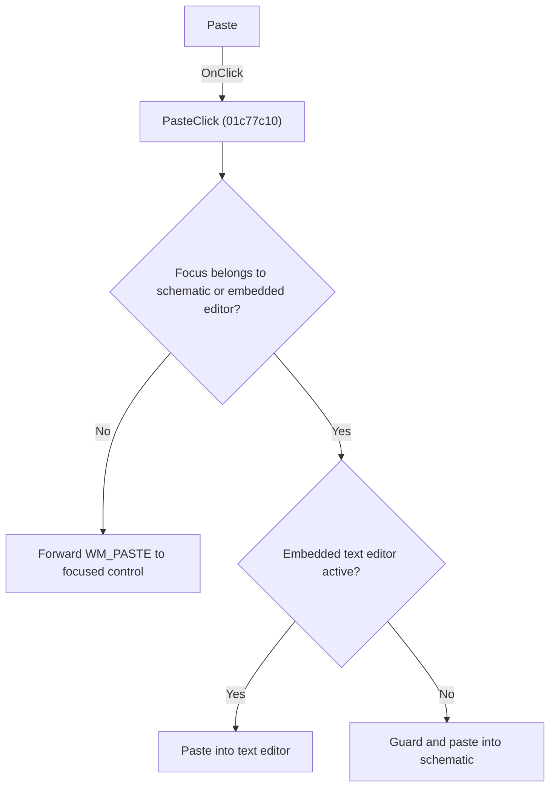

# Paste

> Analysis status: Individually reviewed.

## Control

| Property | Recovered value |
| --- | --- |
| Form | SchematicEditor |
| Component path | SchematicEditor.TopToolBar.GeneralTools.DFPasteBtn |
| Control class | TSpeedButton |
| Caption | Not present in the recovered resource. |
| Hint | Paste |
| Text | Not present in the recovered resource. |
| Handler name | PasteClick |
| Handler address | 01c77c10 |
| Graph node | `resource:dfm:SchematicEditor/SchematicEditor.TopToolBar.GeneralTools.DFPasteBtn` |
| Handler node | `function:01c77c10` |
| Graph layer | UI |

## What happens when clicked

If focus belongs to neither the schematic nor its embedded text editor, the handler forwards WM_PASTE to the focused control. Otherwise it pastes into SynEdit when that editor is active, or into the schematic after its guards pass. The menu and toolbar controls share this behavior.

## Click flow

## Handler evidence

- Source: [DecompiledSources/Tina16/functions/0000000001C77C10__FUN_01c77c10.c](../../../DecompiledSources/Tina16/functions/0000000001C77C10__FUN_01c77c10.c)
- Recovered role: Paste into the active editor context.
- Current graph summary: Handles 2 Delphi UI events: SchematicEditor.TopToolBar.GeneralTools.DFPasteBtn.OnClick, SchematicEditor.MainMenu.Edit.Paste.OnClick.
- Current graph behavior: If focus belongs to neither the schematic nor its embedded text editor, the handler forwards WM_PASTE to the focused control. Otherwise it pastes into SynEdit when that editor is active, or into the schematic after its guards pass. The menu and toolbar controls share this behavior.
- Current graph evidence: The recovered body checks focus and editor-mode fields, contains a WM_PASTE dispatch path, a SynEdit paste method path, and a guarded schematic paste helper path. Sender is unused.
- Complexity: complex
- Distinct outgoing calls: 4

## Direct calls

- `function:0065b870` — FUN_0065b870
- `function:00bf9d90` — FUN_00bf9d90
- `function:01b9bcb0` — FUN_01b9bcb0
- `function:01c8cee0` — FUN_01c8cee0

## Resource evidence

- Kind: Not present in the recovered resource.
- Modal result: Not present in the recovered resource.
- Checked state: Not present in the recovered resource.
- List items: Not present in the recovered resource.
- Image reference: Not present in the recovered resource.
- Extracted glyph: [`0354_SchematicEditor_SchematicEditor_TopToolBar_GeneralTools_DFPasteBtn_Glyph_Data.png`](../../../glyph/0354_SchematicEditor_SchematicEditor_TopToolBar_GeneralTools_DFPasteBtn_Glyph_Data.png)

## Nearby label candidates

Nearby labels are layout candidates only. They are not proof of behavior.

- No same-parent label candidate is available.

## Analysis limits

- The accepted schematic clipboard formats are handled by a downstream helper and are not enumerated here.

