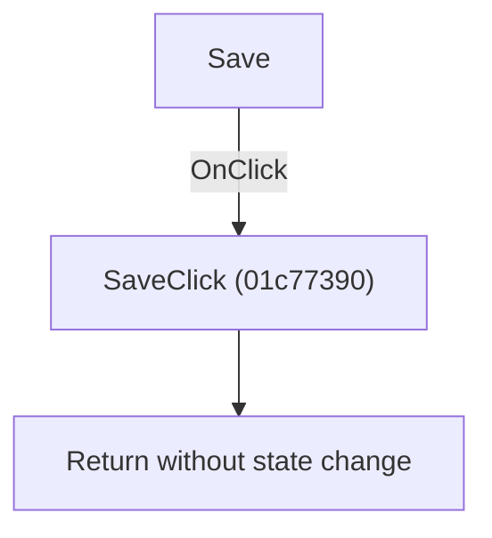

# Save

> Analysis status: Individually reviewed.

## Control

| Property | Recovered value |
| --- | --- |
| Form | SchematicEditor |
| Component path | SchematicEditor.TopToolBar.GeneralTools.DFSaveBtn |
| Control class | TSpeedButton |
| Caption | Not present in the recovered resource. |
| Hint | Save |
| Text | Not present in the recovered resource. |
| Handler name | SaveClick |
| Handler address | 01c77390 |
| Graph node | `resource:dfm:SchematicEditor/SchematicEditor.TopToolBar.GeneralTools.DFSaveBtn` |
| Handler node | `function:01c77390` |
| Graph layer | UI |

## What happens when clicked

The recovered handler returns immediately. It does not call a save routine or change recovered state. The menu and toolbar controls share this no-op handler.

## Click flow

## Handler evidence

- Source: [DecompiledSources/Tina16/functions/0000000001C77390__FUN_01c77390.c](../../../DecompiledSources/Tina16/functions/0000000001C77390__FUN_01c77390.c)
- Recovered role: No-op Save handler.
- Current graph summary: Handles File > Save and the toolbar Save button. In this TINA 16 Demo build, it returns immediately and performs no save work. Handles 2 Delphi UI events: SchematicEditor.TopToolBar.GeneralTools.DFSaveBtn.OnClick, SchematicEditor.MainMenu.mnFile.Save.OnClick.
- Current graph behavior: The recovered handler returns immediately. It does not call a save routine or change recovered state. The menu and toolbar controls share this no-op handler.
- Current graph evidence: FUN_01c77390 is one return instruction and has zero outgoing graph calls. Two DFM OnClick events resolve to it.
- Complexity: simple
- Distinct outgoing calls: 0

## Direct calls

- No direct call edge is present in the recovered graph.

## Resource evidence

- Kind: Not present in the recovered resource.
- Modal result: Not present in the recovered resource.
- Checked state: Not present in the recovered resource.
- List items: Not present in the recovered resource.
- Image reference: Not present in the recovered resource.
- Extracted glyph: [`0356_SchematicEditor_SchematicEditor_TopToolBar_GeneralTools_DFSaveBtn_Glyph_Data.png`](../../../glyph/0356_SchematicEditor_SchematicEditor_TopToolBar_GeneralTools_DFSaveBtn_Glyph_Data.png)

## Nearby label candidates

Nearby labels are layout candidates only. They are not proof of behavior.

- No same-parent label candidate is available.

## Analysis limits

- A save operation may be implemented through another state or action path, but it is not invoked by this recovered handler.

