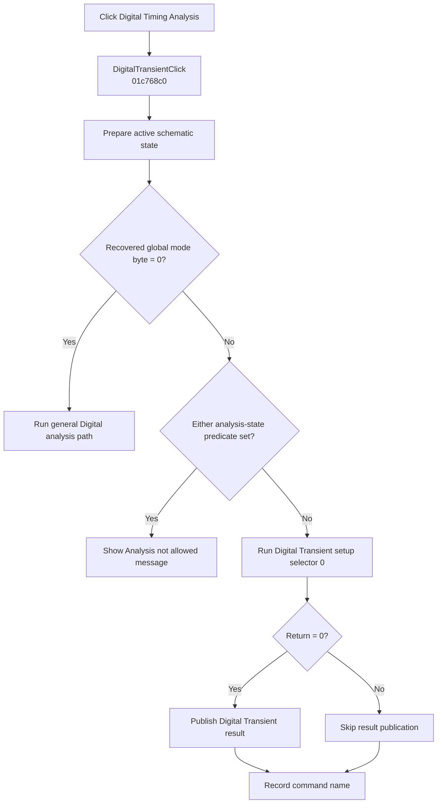

# &Digital Timing Analysis...

> Analysis status: Complete. The handler proves two digital-analysis paths, a design-state guard, cancellation behavior, and result publication.

## Control

| Property | Recovered value |
| --- | --- |
| Form | SchematicEditor |
| Component path | SchematicEditor.MainMenu.mnAnalysis.DigitalTransient |
| Control class | TMenuItem |
| Caption | &Digital Timing Analysis... |
| Hint | Not present in the recovered resource. |
| Text | Not present in the recovered resource. |
| Handler name | DigitalTransientClick |
| Handler address | 01c768c0 |
| Graph node | `resource:dfm:SchematicEditor/SchematicEditor.MainMenu.mnAnalysis.DigitalTransient` |
| Handler node | `function:01c768c0` |
| Graph layer | UI |

## What happens when clicked

`FUN_01c768c0` first prepares analysis context from the active schematic. A recovered global mode byte selects one of two paths.

When that byte is zero, the handler resolves the active application model and calls `FUN_01603f40`, the general Digital analysis path. When the byte is nonzero, the handler checks two schematic state predicates. If either predicate is true, it shows the localized `Sched_c.sAnaNotAllowedTxt` message and stops. Otherwise, it runs `FUN_015267a0` with selector `0`. A zero return publishes the global Digital Transient result through `FUN_013d39a0`; a nonzero return skips publication. The accepted-state branch records `DigitalTransientClick` even when the setup call returns nonzero.

All branches finalize the temporary analysis state. The handler has no local exception recovery.

## Click flow

## Handler evidence

- Source: [DecompiledSources/Tina16/functions/0000000001C768C0__FUN_01c768c0.c](../../../DecompiledSources/Tina16/functions/0000000001C768C0__FUN_01c768c0.c)
- Recovered role: Routes Digital Timing Analysis through the recovered general or interactive path.
- Current graph summary: Handles 1 Delphi UI event: SchematicEditor.MainMenu.mnAnalysis.DigitalTransient.OnClick.
- Current graph behavior: Prepares the active schematic, selects a path from a global mode byte, rejects disallowed interactive states with a localized message, and publishes a Digital Transient result only when setup returns zero.
- Current graph evidence: The handler reads the active schematic at `+0x27a8`, prepares temporary state, branches on `PTR_DAT_020030c0[0x5d]`, and calls either `FUN_01603f40` or the guarded `FUN_015267a0(0)` path. `FUN_013d39a0` is reached only when the latter returns zero. The NetlistEditor digital-transient handler confirms the same setup and publisher pairing.
- Complexity: complex
- Distinct outgoing calls: 19

## Direct calls

- `function:00414480` — Delphi UnicodeString clear and finalization helper
- `function:00414560` — Delphi UnicodeString array finalization helper
- `function:00414ad0` — Delphi UnicodeString assignment helper
- `function:0041ddd0` — FUN_0041ddd0
- `function:00b89270` — FUN_00b89270
- `function:00b8e650` — FUN_00b8e650
- `function:013d39a0` — Creates, registers, and publishes the Digital Transient result
- `function:015267a0` — Opens and prepares Digital Transient analysis for selector 0
- `function:015f23e0` — FUN_015f23e0
- `function:015fca00` — FUN_015fca00
- `function:01603f40` — Runs the general Digital analysis path
- `function:01610c90` — FUN_01610c90
- `function:01610cc0` — FUN_01610cc0
- `function:016fd940` — FUN_016fd940
- `function:019a10d0` — FUN_019a10d0
- `function:019a1cf0` — FUN_019a1cf0
- `function:019a4600` — Returns the active application model
- `function:019af590` — FUN_019af590
- `function:01c76a70` — FUN_01c76a70

## Resource evidence

- Kind: Not present in the recovered resource.
- Modal result: Not present in the recovered resource.
- Checked state: Not present in the recovered resource.
- List items: Not present in the recovered resource.
- Image reference: Not present in the recovered resource.
- Extracted glyph: None.

## Nearby label candidates

Nearby labels are layout candidates only. They are not proof of behavior.

- No same-parent label candidate is available.

## Analysis limits

- The semantic name of global mode byte `PTR_DAT_020030c0[0x5d]` is not recovered.
- The two state predicates are recovered as functions, but their Delphi field names are not available.
- The handler does not distinguish cancellation from other nonzero setup results.
