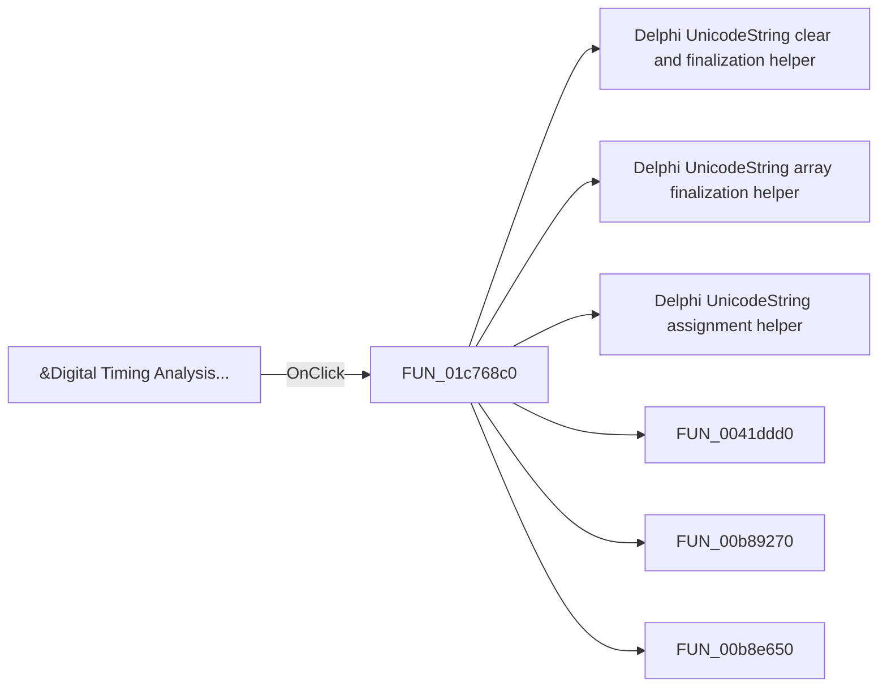

# &Digital Timing Analysis...

> Analysis status: Pending individual source review.

## Control

| Property | Recovered value |
| --- | --- |
| Form | SchematicEditor |
| Component path | SchematicEditor.MainMenu.mnAnalysis.DigitalTransient |
| Control class | TMenuItem |
| Caption | &Digital Timing Analysis... |
| Hint | Not present in the recovered resource. |
| Text | Not present in the recovered resource. |
| Handler name | DigitalTransientClick |
| Handler address | 01c768c0 |
| Graph node | `resource:dfm:SchematicEditor/SchematicEditor.MainMenu.mnAnalysis.DigitalTransient` |
| Handler node | `function:01c768c0` |
| Graph layer | UI |

## What happens when clicked

Pending individual analysis. An agent must read the recovered handler source and its relevant callees before it replaces this text.

## Click flow

## Handler evidence

- Source: [DecompiledSources/Tina16/functions/0000000001C768C0__FUN_01c768c0.c](../../../DecompiledSources/Tina16/functions/0000000001C768C0__FUN_01c768c0.c)
- Recovered role: Not present in the recovered resource.
- Current graph summary: Handles 1 Delphi UI event: SchematicEditor.MainMenu.mnAnalysis.DigitalTransient.OnClick.
- Current graph behavior: Not present in the recovered resource.
- Current graph evidence: Not present in the recovered resource.
- Complexity: complex
- Distinct outgoing calls: 19

## Direct calls

- `function:00414480` — Delphi UnicodeString clear and finalization helper
- `function:00414560` — Delphi UnicodeString array finalization helper
- `function:00414ad0` — Delphi UnicodeString assignment helper
- `function:0041ddd0` — FUN_0041ddd0
- `function:00b89270` — FUN_00b89270
- `function:00b8e650` — FUN_00b8e650
- `function:013d39a0` — FUN_013d39a0
- `function:015267a0` — FUN_015267a0
- `function:015f23e0` — FUN_015f23e0
- `function:015fca00` — FUN_015fca00
- `function:01603f40` — FUN_01603f40
- `function:01610c90` — FUN_01610c90
- `function:01610cc0` — FUN_01610cc0
- `function:016fd940` — FUN_016fd940
- `function:019a10d0` — FUN_019a10d0
- `function:019a1cf0` — FUN_019a1cf0
- `function:019a4600` — FUN_019a4600
- `function:019af590` — FUN_019af590
- `function:01c76a70` — FUN_01c76a70

## Resource evidence

- Kind: Not present in the recovered resource.
- Modal result: Not present in the recovered resource.
- Checked state: Not present in the recovered resource.
- List items: Not present in the recovered resource.
- Image reference: Not present in the recovered resource.
- Extracted glyph: None.

## Nearby label candidates

Nearby labels are layout candidates only. They are not proof of behavior.

- No same-parent label candidate is available.

## Analysis limits

- Do not infer behavior from the control class, caption, hint, glyph, or nearby label alone.
- Do not replace the pending status until the handler source and relevant call path provide enough evidence.
