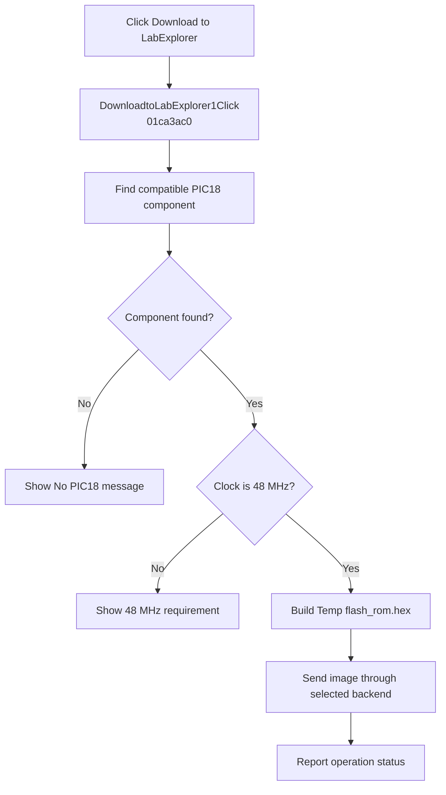

# Download to LabExplorer...

> Analysis status: Evidence-backed source review complete.

## Control

| Property | Recovered value |
| --- | --- |
| Form | SchematicEditor |
| Component path | SchematicEditor.MainMenu.mnTM.DownloadtoLabExplorer1 |
| Control class | TMenuItem |
| Caption | Download to LabExplorer... |
| Hint | Not present in the recovered resource. |
| Text | Not present in the recovered resource. |
| Handler name | DownloadtoLabExplorer1Click |
| Handler address | 01ca3ac0 |
| Graph node | `resource:dfm:SchematicEditor/SchematicEditor.MainMenu.mnTM.DownloadtoLabExplorer1` |
| Handler node | `function:01ca3ac0` |
| Graph layer | UI |

## What happens when clicked

`DownloadtoLabExplorer1Click` calls [`FUN_016012b0`](../../../DecompiledSources/Tina16/functions/00000000016012B0__FUN_016012b0.c) for the current schematic. That routine recursively searches the circuit for a compatible component with recovered type selector `8`. If no current schematic exists, it returns without a change. If no compatible PIC18 component is found, it shows the localized `HDLStrings.Msg_NoPic18` message.

For a compatible component, [`FUN_01600b60`](../../../DecompiledSources/Tina16/functions/0000000001600B60__FUN_01600b60.c) requires a recovered clock value of `48000000.0`. A different value shows `HDLStrings.Msg_No48MHzPic18`. The accepted path builds `Temp\flash_rom.hex`, runs the recovered simulator or compiler preparation when required, and sends the generated program image through the selected download backend. An unsupported backend shows `HDLStrings.Msg_CannotDownload`. The method also writes the required Intel HEX trailer records, clears temporary compiler state, and reports the final operation status.

The click has no confirmation step and no local rollback. Its success result is returned to the wrapper, but the click handler does not use that value.

## Click flow

## Handler evidence

- Source: [DecompiledSources/Tina16/functions/0000000001CA3AC0__FUN_01ca3ac0.c](../../../DecompiledSources/Tina16/functions/0000000001CA3AC0__FUN_01ca3ac0.c)
- Recovered role: Build and download the current circuit's compatible PIC18 program image.
- Current graph summary: Handles 1 Delphi UI event: SchematicEditor.MainMenu.mnTM.DownloadtoLabExplorer1.OnClick.
- Current graph behavior: Searches the current circuit for a compatible PIC18 component, requires a 48 MHz clock, builds an Intel HEX image, and sends it through the selected download backend.
- Current graph evidence: The wrapper passes control to `FUN_016012b0`. Its source contains `HDLStrings.Msg_NoPic18`; the accepted callee contains the 48 MHz comparison, `flash_rom.hex`, Intel HEX trailer records, backend calls, and the `Msg_No48MHzPic18` and `Msg_CannotDownload` error paths.
- Complexity: simple
- Distinct outgoing calls: 1

## Direct calls

- `function:016012b0` — [FUN_016012b0](../../../DecompiledSources/Tina16/functions/00000000016012B0__FUN_016012b0.c), finds the compatible circuit component and reports a missing PIC18.
- `function:01600b60` — [FUN_01600b60](../../../DecompiledSources/Tina16/functions/0000000001600B60__FUN_01600b60.c), builds and downloads the program image.

## Resource evidence

- Kind: Not present in the recovered resource.
- Modal result: Not present in the recovered resource.
- Checked state: Not present in the recovered resource.
- List items: Not present in the recovered resource.
- Image reference: Not present in the recovered resource.
- Extracted glyph: None.

## Nearby label candidates

Nearby labels are layout candidates only. They are not proof of behavior.

- No same-parent label candidate is available.

## Analysis limits

- The original Delphi enumeration names for component selector `8` and the backend mode values are not recovered.
- The path proves image generation and backend dispatch. It does not prove that external hardware accepts or runs the image.

