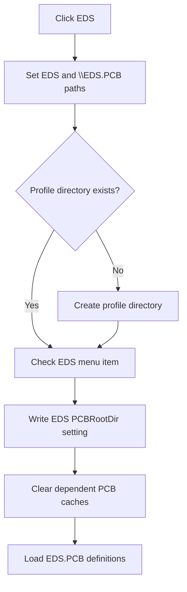

# EDS

> Analysis status: Reviewed from the recovered PCB profile, directory, settings, cache, and menu-state path.

## Control

| Property | Recovered value |
| --- | --- |
| Form | SchematicEditor |
| Component path | SchematicEditor.MainMenu.mnFile.pcbdirectory1.EDSPCB1 |
| Control class | TMenuItem |
| Caption | EDS |
| Hint | Not present in the recovered resource. |
| Text | Not present in the recovered resource. |
| Handler name | EDSPCB1Click |
| Handler address | 01c95610 |
| Graph node | `resource:dfm:SchematicEditor/SchematicEditor.MainMenu.mnFile.pcbdirectory1.EDSPCB1` |
| Handler node | `function:01c95610` |
| Graph layer | UI |

## What happens when clicked

The handler selects the EDS PCB profile. It clears the previous PCB-directory cache, sets the profile file to `\EDS.PCB`, and uses the same recovered EDS key for settings and reload. It makes the profile directory when it is absent and checks this menu item.

It writes the selected EDS key to `PCBRootDir` in the `Schematic Editor` settings section, clears two dependent caches, and reloads the EDS `.PCB` definition data. The EDS key is referenced through a recovered static data address rather than rendered as a string literal, but the file name, menu resource, and identical data flow establish the selected profile.

## Click flow

## Handler evidence

- Source: [DecompiledSources/Tina16/functions/0000000001C95610__FUN_01c95610.c](../../../DecompiledSources/Tina16/functions/0000000001C95610__FUN_01c95610.c)
- Recovered role: Select and load the EDS PCB profile.
- Current graph summary: Handles 1 Delphi UI event: SchematicEditor.MainMenu.mnFile.pcbdirectory1.EDSPCB1.OnClick.
- Current graph behavior: Selects, persists, and reloads the EDS PCB definition profile.
- Current graph evidence: `FUN_01c95610` contains `\EDS.PCB`, uses one static key for the selected path, settings value, and reload call, checks the EDS menu field, and follows the same recovered sequence as the literal ALTIUM, ORCAD, PCAD, PROTEL, REDAC, TANGO, and TINA handlers.
- Complexity: complex
- Distinct outgoing calls: 10

## Direct calls

- `function:00414560` — Delphi UnicodeString array finalization helper
- `function:00414ad0` — Delphi UnicodeString assignment helper
- `function:00416ba0` — FUN_00416ba0
- `function:00442400` — FUN_00442400
- `function:007e2d20` — FUN_007e2d20
- `function:00b96de0` — FUN_00b96de0
- `function:00eadc90` — FUN_00eadc90
- `function:00eae050` — FUN_00eae050
- `function:00ec0300` — FUN_00ec0300
- `function:00ecbc20` — FUN_00ecbc20

## Resource evidence

- Kind: Not present in the recovered resource.
- Modal result: Not present in the recovered resource.
- Checked state: Not present in the recovered resource.
- List items: Not present in the recovered resource.
- Image reference: Not present in the recovered resource.
- Extracted glyph: None.

## Nearby label candidates

Nearby labels are layout candidates only. They are not proof of behavior.

- No same-parent label candidate is available.

## Analysis limits

- The decompiler represents the EDS key as `DAT_01c95788`; it does not render the literal bytes in this C file.
- Directory or definition-load errors are not caught locally.

