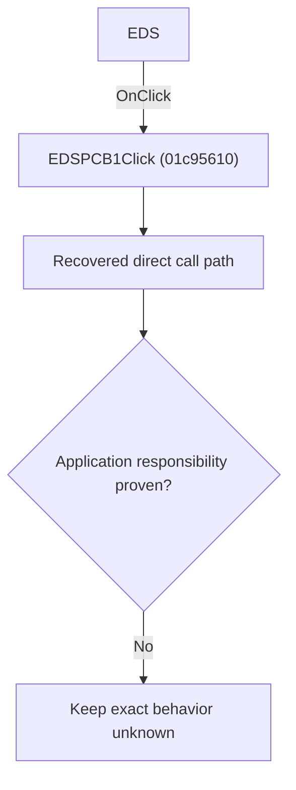

# EDS

> Analysis status: Blocked by an exact evidence gap.

## Control

| Property | Recovered value |
| --- | --- |
| Form | SchematicEditor |
| Component path | SchematicEditor.MainMenu.mnFile.pcbdirectory1.EDSPCB1 |
| Control class | TMenuItem |
| Caption | EDS |
| Hint | Not present in the recovered resource. |
| Text | Not present in the recovered resource. |
| Handler name | EDSPCB1Click |
| Handler address | 01c95610 |
| Graph node | `resource:dfm:SchematicEditor/SchematicEditor.MainMenu.mnFile.pcbdirectory1.EDSPCB1` |
| Handler node | `function:01c95610` |
| Graph layer | UI |

## What happens when clicked

The OnClick binding reaches EDSPCB1Click at 01c95610. The recovered body has 10 distinct outgoing graph call(s), but the application-specific responsibilities and data effects of its downstream path are not established in the accepted graph evidence. The control's caption or name indicates user intent only; it is not enough to claim implementation behavior.

## Click flow

## Handler evidence

- Source: [DecompiledSources/Tina16/functions/0000000001C95610__FUN_01c95610.c](../../../DecompiledSources/Tina16/functions/0000000001C95610__FUN_01c95610.c)
- Recovered role: Evidence-blocked EDSPCB1Click command.
- Current graph summary: Handles 1 Delphi UI event: SchematicEditor.MainMenu.mnFile.pcbdirectory1.EDSPCB1.OnClick.
- Current graph behavior: The OnClick binding reaches EDSPCB1Click at 01c95610. The recovered body has 10 distinct outgoing graph call(s), but the application-specific responsibilities and data effects of its downstream path are not established in the accepted graph evidence. The control's caption or name indicates user intent only; it is not enough to claim implementation behavior.
- Current graph evidence: The DFM binds SchematicEditor.MainMenu.mnFile.pcbdirectory1.EDSPCB1 to EDSPCB1Click. The recovered source is DecompiledSources/Tina16/functions/0000000001C95610__FUN_01c95610.c and directly references 00414560, 00414ad0, 00416ba0, 00442400, 007e2d20, 00b96de0, 00eadc90, 00eae050, and 2 more. No accepted end-to-end role was established for this control path.
- Complexity: complex
- Distinct outgoing calls: 10

## Direct calls

- `function:00414560` — Delphi UnicodeString array finalization helper
- `function:00414ad0` — Delphi UnicodeString assignment helper
- `function:00416ba0` — FUN_00416ba0
- `function:00442400` — FUN_00442400
- `function:007e2d20` — FUN_007e2d20
- `function:00b96de0` — FUN_00b96de0
- `function:00eadc90` — FUN_00eadc90
- `function:00eae050` — FUN_00eae050
- `function:00ec0300` — FUN_00ec0300
- `function:00ecbc20` — FUN_00ecbc20

## Resource evidence

- Kind: Not present in the recovered resource.
- Modal result: Not present in the recovered resource.
- Checked state: Not present in the recovered resource.
- List items: Not present in the recovered resource.
- Image reference: Not present in the recovered resource.
- Extracted glyph: None.

## Nearby label candidates

Nearby labels are layout candidates only. They are not proof of behavior.

- No same-parent label candidate is available.

## Analysis limits

- Exact gap: the recovered handler or one of its direct application callees lacks a source-supported role that proves the command's decisions, state changes, and output. Keep this Bead open until those callees are traced.

