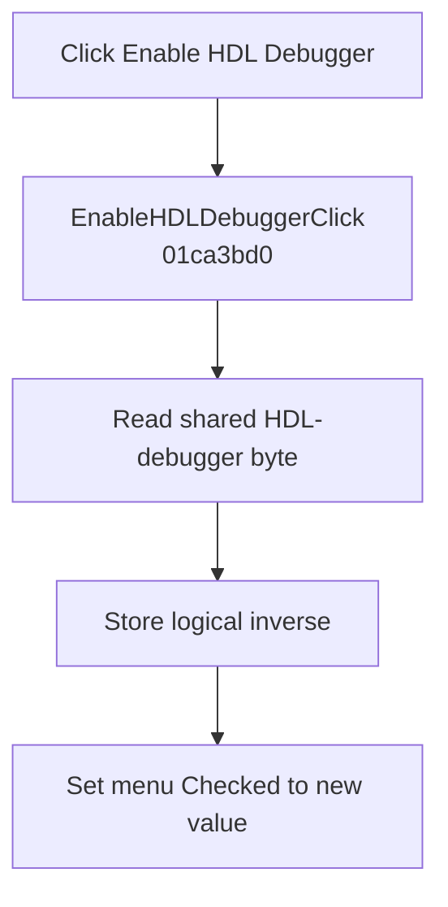

# Enable HDL Debugger

> Analysis status: Complete. The handler toggles the shared HDL-debugger flag and synchronizes the menu check.

## Control

| Property | Recovered value |
| --- | --- |
| Form | SchematicEditor |
| Component path | SchematicEditor.MainMenu.mnAnalysis.EnableHDLDebugger |
| Control class | TMenuItem |
| Caption | Enable HDL Debugger |
| Hint | Not present in the recovered resource. |
| Text | Not present in the recovered resource. |
| Handler name | EnableHDLDebuggerClick |
| Handler address | 01ca3bd0 |
| Graph node | `resource:dfm:SchematicEditor/SchematicEditor.MainMenu.mnAnalysis.EnableHDLDebugger` |
| Handler node | `function:01ca3bd0` |
| Graph layer | UI |

## What happens when clicked

`FUN_01ca3bd0` reads the shared byte at `PTR_DAT_020030c0 + 1`, writes its logical inverse, and passes the new value to `FUN_007e2d20` for the `EnableHDLDebugger` menu item at form offset `+0x1610`.

The VCL helper updates the menu only when the checked state changed. This click does not start, stop, or attach an HDL debugger. It only changes the enable flag and visible menu check.

## Click flow

## Handler evidence

- Source: [DecompiledSources/Tina16/functions/0000000001CA3BD0__FUN_01ca3bd0.c](../../../DecompiledSources/Tina16/functions/0000000001CA3BD0__FUN_01ca3bd0.c)
- Recovered role: Toggles the shared HDL-debugger enable flag and menu check.
- Current graph summary: Handles 1 Delphi UI event: SchematicEditor.MainMenu.mnAnalysis.EnableHDLDebugger.OnClick.
- Current graph behavior: Inverts the shared HDL-debugger byte and synchronizes the Enable HDL Debugger menu item's checked state.
- Current graph evidence: `FUN_01ca3bd0` reads and writes `PTR_DAT_020030c0[1]` and passes the same inverted value to the recovered VCL menu checked-state helper for the menu item at `+0x1610`.
- Complexity: simple
- Distinct outgoing calls: 1

## Direct calls

- `function:007e2d20` — Updates the VCL menu item's checked state when needed

## Resource evidence

- Kind: Not present in the recovered resource.
- Modal result: Not present in the recovered resource.
- Checked state: Not present in the recovered resource.
- List items: Not present in the recovered resource.
- Image reference: Not present in the recovered resource.
- Extracted glyph: None.

## Nearby label candidates

Nearby labels are layout candidates only. They are not proof of behavior.

- No same-parent label candidate is available.

## Analysis limits

- No debugger session is created, stopped, or attached in this handler.
- The persistence owner for the shared enable byte is not part of this click path.
