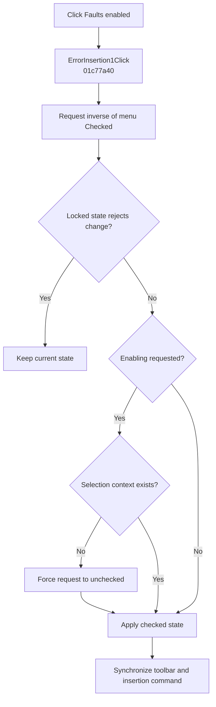

# &Faults enabled

> Analysis status: Complete. The helper guard, selection check, menu state, toolbar state, and editor command refresh are recovered.

## Control

| Property | Recovered value |
| --- | --- |
| Form | SchematicEditor |
| Component path | SchematicEditor.MainMenu.mnAnalysis.ErrorInsertion1 |
| Control class | TMenuItem |
| Caption | &Faults enabled |
| Hint | Not present in the recovered resource. |
| Text | Not present in the recovered resource. |
| Handler name | ErrorInsertion1Click |
| Handler address | 01c77a40 |
| Graph node | `resource:dfm:SchematicEditor/SchematicEditor.MainMenu.mnAnalysis.ErrorInsertion1` |
| Handler node | `function:01c77a40` |
| Graph layer | UI |

## What happens when clicked

`FUN_01c77a40` requests the inverse of the current `ErrorInsertion1` checked byte and passes it to `FUN_01c779c0`.

The helper first enforces two editor state bytes at `+0x182a` and `+0x182b`; a mismatched locked state is a no-op. When enabling is requested, it also requires a selected context from `FUN_01c7da00`. Without that context, it forces the request to unchecked. It then updates the menu check, synchronizes the paired toolbar tool, selects the current or default object type, and refreshes the active schematic's insertion command.

The click changes the editor's fault-insertion mode. It does not insert a fault by itself.

## Click flow

## Handler evidence

- Source: [DecompiledSources/Tina16/functions/0000000001C77A40__FUN_01c77a40.c](../../../DecompiledSources/Tina16/functions/0000000001C77A40__FUN_01c77a40.c)
- Recovered role: Toggles fault-insertion mode subject to editor and selection guards.
- Current graph summary: Handles 1 Delphi UI event: SchematicEditor.MainMenu.mnAnalysis.ErrorInsertion1.OnClick.
- Current graph behavior: Requests the inverse menu state, keeps the current state when the editor lock rejects it, prevents enablement without a selection context, and otherwise synchronizes the menu, toolbar, and active insertion command.
- Current graph evidence: `FUN_01c77a40` reads menu byte `+0x80` and calls `FUN_01c779c0` with its inverse. The helper checks form bytes `+0x182a/+0x182b`, gates enablement on `FUN_01c7da00`, updates the menu with `FUN_007e2d20`, updates the paired tool with `FUN_0082a6c0`, and calls `FUN_01c77ab0` to refresh the active command type.
- Complexity: simple
- Distinct outgoing calls: 1

## Direct calls

- `function:01c779c0` — Applies guarded fault-insertion state and synchronizes editor controls

## Resource evidence

- Kind: Not present in the recovered resource.
- Modal result: Not present in the recovered resource.
- Checked state: Not present in the recovered resource.
- List items: Not present in the recovered resource.
- Image reference: Not present in the recovered resource.
- Extracted glyph: None.

## Nearby label candidates

Nearby labels are layout candidates only. They are not proof of behavior.

- No same-parent label candidate is available.

## Analysis limits

- The Delphi names of the two editor lock bytes are not recovered.
- The click enables or disables a mode; the later placement of a fault is outside this handler.
