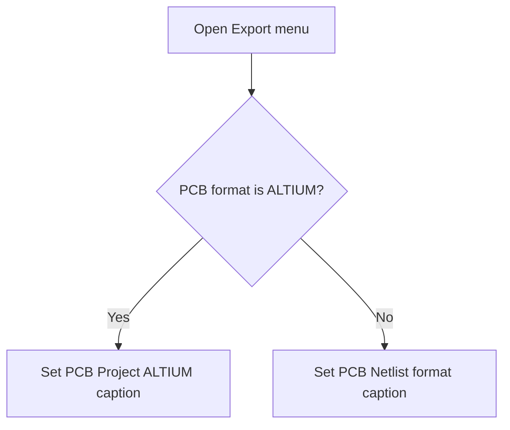

# &Export

> Analysis status: Reviewed from the PCB-format state and menu-caption update path.

## Control

| Property | Recovered value |
| --- | --- |
| Form | SchematicEditor |
| Component path | SchematicEditor.MainMenu.mnFile.Export |
| Control class | TMenuItem |
| Caption | &Export |
| Hint | Not present in the recovered resource. |
| Text | Not present in the recovered resource. |
| Handler name | ExportClick |
| Handler address | 01c96d70 |
| Graph node | `resource:dfm:SchematicEditor/SchematicEditor.MainMenu.mnFile.Export` |
| Handler node | `function:01c96d70` |
| Graph layer | UI |

## What happens when clicked

This parent Export item does not write a file. When the menu opens or the item receives its click event, the handler updates the caption of the PCB export child item. If the configured PCB format is exactly `ALTIUM`, it sets the caption to `PCB Project (ALTIUM)...`. For all other format strings, it sets the caption to `PCB Netlist (<format>)...`.

## Click flow

## Handler evidence

- Source: [DecompiledSources/Tina16/functions/0000000001C96D70__FUN_01c96d70.c](../../../DecompiledSources/Tina16/functions/0000000001C96D70__FUN_01c96d70.c)
- Recovered role: Update the PCB export child caption from the configured PCB format.
- Current graph summary: Handles 1 Delphi UI event: SchematicEditor.MainMenu.mnFile.Export.OnClick.
- Current graph behavior: Chooses one of two PCB export captions and applies it to the PCB export child item.
- Current graph evidence: `FUN_01c96d70` compares the configured PCB format string with `ALTIUM`. The equal branch builds `PCB Project (ALTIUM)...`; the other branch formats `PCB Netlist (%s)...`. Both branches call the VCL menu-caption setter `FUN_007e2c60` on the child menu field at editor offset `+0x1028`.
- Complexity: complex
- Distinct outgoing calls: 4

## Direct calls

- `function:00414560` — Delphi UnicodeString array finalization helper
- `function:00416cd0` — FUN_00416cd0
- `function:0043e420` — FUN_0043e420
- `function:007e2c60` — FUN_007e2c60

## Resource evidence

- Kind: Not present in the recovered resource.
- Modal result: Not present in the recovered resource.
- Checked state: Not present in the recovered resource.
- List items: Not present in the recovered resource.
- Image reference: Not present in the recovered resource.
- Extracted glyph: None.

## Nearby label candidates

Nearby labels are layout candidates only. They are not proof of behavior.

- No same-parent label candidate is available.

## Analysis limits

- File export occurs only when the user selects a child export command.

