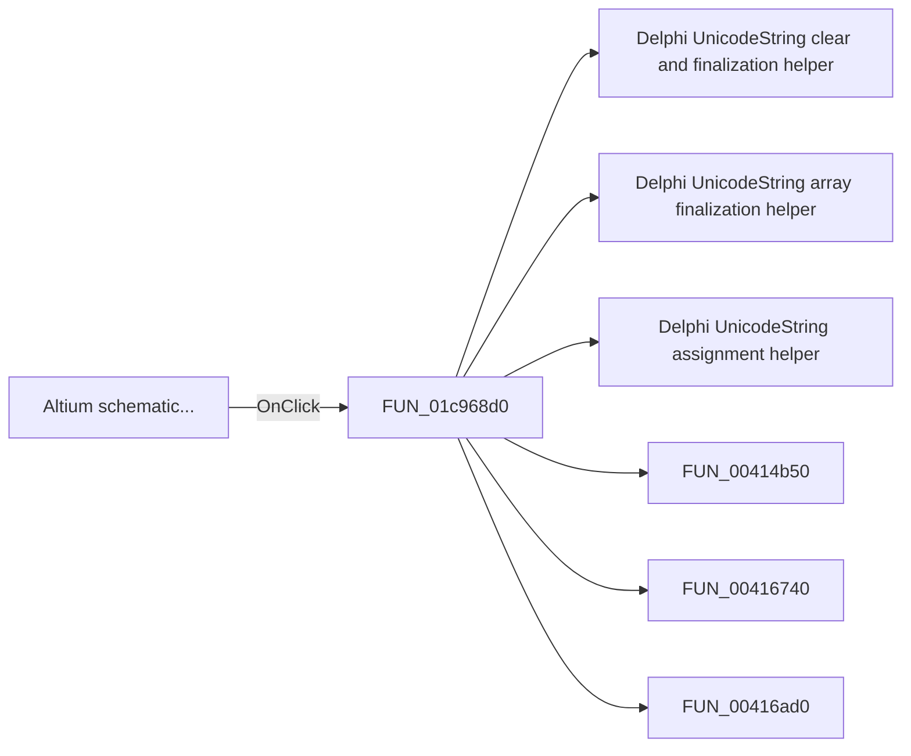

# Altium schematic...

> Analysis status: Pending individual source review.

## Control

| Property | Recovered value |
| --- | --- |
| Form | SchematicEditor |
| Component path | SchematicEditor.MainMenu.mnFile.Export.ExportAltiumSchematic |
| Control class | TMenuItem |
| Caption | Altium schematic... |
| Hint | Not present in the recovered resource. |
| Text | Not present in the recovered resource. |
| Handler name | ExportAltiumSchematicClick |
| Handler address | 01c968d0 |
| Graph node | `resource:dfm:SchematicEditor/SchematicEditor.MainMenu.mnFile.Export.ExportAltiumSchematic` |
| Handler node | `function:01c968d0` |
| Graph layer | UI |

## What happens when clicked

Pending individual analysis. An agent must read the recovered handler source and its relevant callees before it replaces this text.

## Click flow

## Handler evidence

- Source: [DecompiledSources/Tina16/functions/0000000001C968D0__FUN_01c968d0.c](../../../DecompiledSources/Tina16/functions/0000000001C968D0__FUN_01c968d0.c)
- Recovered role: Not present in the recovered resource.
- Current graph summary: Handles 1 Delphi UI event: SchematicEditor.MainMenu.mnFile.Export.ExportAltiumSchematic.OnClick.
- Current graph behavior: Not present in the recovered resource.
- Current graph evidence: Not present in the recovered resource.
- Complexity: complex
- Distinct outgoing calls: 20

## Direct calls

- `function:00414480` — Delphi UnicodeString clear and finalization helper
- `function:00414560` — Delphi UnicodeString array finalization helper
- `function:00414ad0` — Delphi UnicodeString assignment helper
- `function:00414b50` — FUN_00414b50
- `function:00416740` — FUN_00416740
- `function:00416ad0` — FUN_00416ad0
- `function:00416ba0` — FUN_00416ba0
- `function:00416cd0` — FUN_00416cd0
- `function:00417c40` — FUN_00417c40
- `function:0041b800` — FUN_0041b800
- `function:004414c0` — FUN_004414c0
- `function:00441640` — FUN_00441640
- `function:00441920` — FUN_00441920
- `function:00724270` — FUN_00724270
- `function:00724380` — FUN_00724380
- `function:00bac3d0` — FUN_00bac3d0
- `function:0128ee00` — FUN_0128ee00
- `function:016fd940` — FUN_016fd940
- `function:01b23030` — FUN_01b23030
- `function:01bc47d0` — FUN_01bc47d0

## Resource evidence

- Kind: Not present in the recovered resource.
- Modal result: Not present in the recovered resource.
- Checked state: Not present in the recovered resource.
- List items: Not present in the recovered resource.
- Image reference: Not present in the recovered resource.
- Extracted glyph: None.

## Nearby label candidates

Nearby labels are layout candidates only. They are not proof of behavior.

- No same-parent label candidate is available.

## Analysis limits

- Do not infer behavior from the control class, caption, hint, glyph, or nearby label alone.
- Do not replace the pending status until the handler source and relevant call path provide enough evidence.
