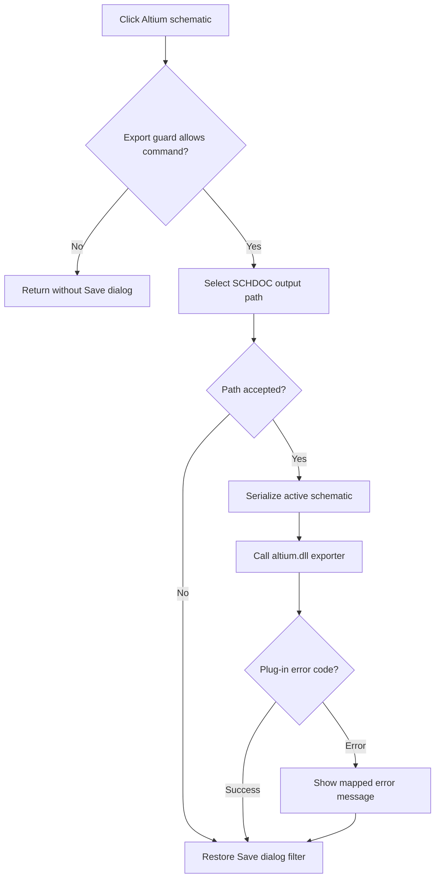

# Altium schematic...

> Analysis status: Reviewed from the export guard, save-dialog, serializer, and Altium plug-in paths.

## Control

| Property | Recovered value |
| --- | --- |
| Form | SchematicEditor |
| Component path | SchematicEditor.MainMenu.mnFile.Export.ExportAltiumSchematic |
| Control class | TMenuItem |
| Caption | Altium schematic... |
| Hint | Not present in the recovered resource. |
| Text | Not present in the recovered resource. |
| Handler name | ExportAltiumSchematicClick |
| Handler address | 01c968d0 |
| Graph node | `resource:dfm:SchematicEditor/SchematicEditor.MainMenu.mnFile.Export.ExportAltiumSchematic` |
| Handler node | `function:01c968d0` |
| Graph layer | UI |

## What happens when clicked

The handler first checks an export guard. A nonzero guard result stops the command before the Save dialog. Otherwise, it configures the shared Save dialog for an Altium `*.schdoc` file and proposes a name from the current schematic. Cancel produces no file. After acceptance, the handler finds `altium.dll`, serializes the active schematic and its settings, and passes the serialized data and selected path to the Altium plug-in. Plug-in error codes 1 through 10 select mapped error messages. The handler restores the Save dialog's previous filter before it returns.

## Click flow

## Handler evidence

- Source: [DecompiledSources/Tina16/functions/0000000001C968D0__FUN_01c968d0.c](../../../DecompiledSources/Tina16/functions/0000000001C968D0__FUN_01c968d0.c)
- Recovered role: Export the active schematic through the Altium SCHDOC plug-in.
- Current graph summary: Handles 1 Delphi UI event: SchematicEditor.MainMenu.mnFile.Export.ExportAltiumSchematic.OnClick.
- Current graph behavior: Guards the command, collects an SCHDOC path, serializes the current schematic, calls the Altium exporter, reports mapped plug-in errors, and restores shared dialog state.
- Current graph evidence: `FUN_01c968d0` returns on a nonzero `FUN_01b23030` result, configures the dialog at editor offset `+0xb40` with extension `schdoc`, and branches on its execute result. It locates `altium.dll` through `FUN_01bc47d0`, serializes the active schematic through `FUN_0128ee00`, invokes the loaded plug-in entry, maps return codes 1 through 10 to message entries, and calls `FUN_016fd940` for an error. It copies the original dialog filter back before return.
- Complexity: complex
- Distinct outgoing calls: 20

## Direct calls

- `function:00414480` — Delphi UnicodeString clear and finalization helper
- `function:00414560` — Delphi UnicodeString array finalization helper
- `function:00414ad0` — Delphi UnicodeString assignment helper
- `function:00414b50` — FUN_00414b50
- `function:00416740` — FUN_00416740
- `function:00416ad0` — FUN_00416ad0
- `function:00416ba0` — FUN_00416ba0
- `function:00416cd0` — FUN_00416cd0
- `function:00417c40` — FUN_00417c40
- `function:0041b800` — FUN_0041b800
- `function:004414c0` — FUN_004414c0
- `function:00441640` — FUN_00441640
- `function:00441920` — FUN_00441920
- `function:00724270` — FUN_00724270
- `function:00724380` — FUN_00724380
- `function:00bac3d0` — FUN_00bac3d0
- `function:0128ee00` — FUN_0128ee00
- `function:016fd940` — FUN_016fd940
- `function:01b23030` — FUN_01b23030
- `function:01bc47d0` — FUN_01bc47d0

## Resource evidence

- Kind: Not present in the recovered resource.
- Modal result: Not present in the recovered resource.
- Checked state: Not present in the recovered resource.
- List items: Not present in the recovered resource.
- Image reference: Not present in the recovered resource.
- Extracted glyph: None.

## Nearby label candidates

Nearby labels are layout candidates only. They are not proof of behavior.

- No same-parent label candidate is available.

## Analysis limits

- The recovered source does not name the condition tested by `FUN_01b23030`; this article describes it only as an export guard.
- Plug-in behavior after the dynamic call is outside the recovered executable source.

