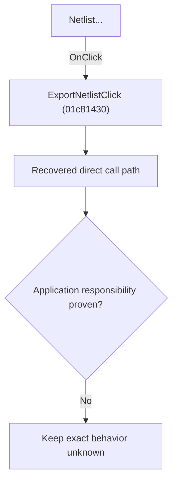

# Netlist...

> Analysis status: Blocked by an exact evidence gap.

## Control

| Property | Recovered value |
| --- | --- |
| Form | SchematicEditor |
| Component path | SchematicEditor.MainMenu.mnFile.Export.ExportNetlist |
| Control class | TMenuItem |
| Caption | Netlist... |
| Hint | Not present in the recovered resource. |
| Text | Not present in the recovered resource. |
| Handler name | ExportNetlistClick |
| Handler address | 01c81430 |
| Graph node | `resource:dfm:SchematicEditor/SchematicEditor.MainMenu.mnFile.Export.ExportNetlist` |
| Handler node | `function:01c81430` |
| Graph layer | UI |

## What happens when clicked

The OnClick binding reaches ExportNetlistClick at 01c81430. The recovered body has 4 distinct outgoing graph call(s), but the application-specific responsibilities and data effects of its downstream path are not established in the accepted graph evidence. The control's caption or name indicates user intent only; it is not enough to claim implementation behavior.

## Click flow

## Handler evidence

- Source: [DecompiledSources/Tina16/functions/0000000001C81430__FUN_01c81430.c](../../../DecompiledSources/Tina16/functions/0000000001C81430__FUN_01c81430.c)
- Recovered role: Evidence-blocked ExportNetlistClick command.
- Current graph summary: Handles 1 Delphi UI event: SchematicEditor.MainMenu.mnFile.Export.ExportNetlist.OnClick.
- Current graph behavior: The OnClick binding reaches ExportNetlistClick at 01c81430. The recovered body has 4 distinct outgoing graph call(s), but the application-specific responsibilities and data effects of its downstream path are not established in the accepted graph evidence. The control's caption or name indicates user intent only; it is not enough to claim implementation behavior.
- Current graph evidence: The DFM binds SchematicEditor.MainMenu.mnFile.Export.ExportNetlist to ExportNetlistClick. The recovered source is DecompiledSources/Tina16/functions/0000000001C81430__FUN_01c81430.c and directly references 00410f20, 00414480, 01badfb0, 01c8a3c0. No accepted end-to-end role was established for this control path.
- Complexity: complex
- Distinct outgoing calls: 4

## Direct calls

- `function:00410f20` — Nil-safe Delphi object destruction helper
- `function:00414480` — Delphi UnicodeString clear and finalization helper
- `function:01badfb0` — FUN_01badfb0
- `function:01c8a3c0` — FUN_01c8a3c0

## Resource evidence

- Kind: Not present in the recovered resource.
- Modal result: Not present in the recovered resource.
- Checked state: Not present in the recovered resource.
- List items: Not present in the recovered resource.
- Image reference: Not present in the recovered resource.
- Extracted glyph: None.

## Nearby label candidates

Nearby labels are layout candidates only. They are not proof of behavior.

- No same-parent label candidate is available.

## Analysis limits

- Exact gap: the recovered handler or one of its direct application callees lacks a source-supported role that proves the command's decisions, state changes, and output. Keep this Bead open until those callees are traced.

