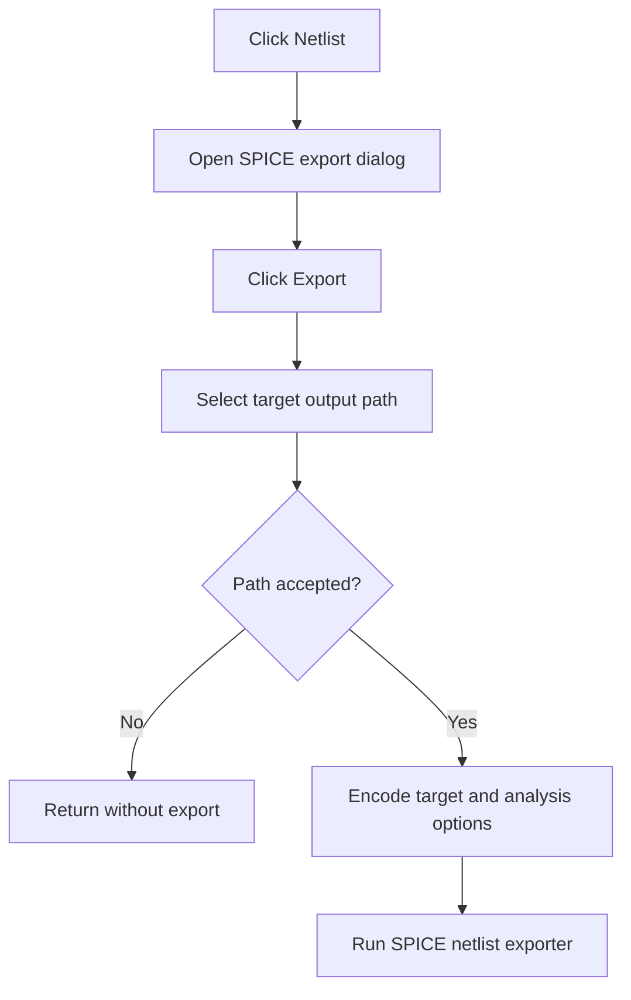

# Netlist...

> Analysis status: Reviewed from the SPICE export dialog and Export-button path.

## Control

| Property | Recovered value |
| --- | --- |
| Form | SchematicEditor |
| Component path | SchematicEditor.MainMenu.mnFile.Export.ExportNetlist |
| Control class | TMenuItem |
| Caption | Netlist... |
| Hint | Not present in the recovered resource. |
| Text | Not present in the recovered resource. |
| Handler name | ExportNetlistClick |
| Handler address | 01c81430 |
| Graph node | `resource:dfm:SchematicEditor/SchematicEditor.MainMenu.mnFile.Export.ExportNetlist` |
| Handler node | `function:01c81430` |
| Graph layer | UI |

## What happens when clicked

The handler gets the active schematic and opens `frmSpiceExportDlg` with the current schematic and export context. The dialog lets the user select a target, macro mode, and Transient, DC Transfer, or AC Transfer options. Its Export button prepares a target-specific file name and initial directory, then opens a Save dialog. Cancel stops the export. After path acceptance, the button encodes the selected analysis options and calls the SPICE exporter with the selected target, path, active graph, and analysis state. The menu handler destroys the dialog after it closes.

## Click flow

## Handler evidence

- Source: [DecompiledSources/Tina16/functions/0000000001C81430__FUN_01c81430.c](../../../DecompiledSources/Tina16/functions/0000000001C81430__FUN_01c81430.c)
- Recovered role: Open the target-specific SPICE netlist export dialog.
- Current graph summary: Handles 1 Delphi UI event: SchematicEditor.MainMenu.mnFile.Export.ExportNetlist.OnClick.
- Current graph behavior: Shows the SPICE export dialog for the active schematic. The dialog Export path writes only after its Save dialog succeeds.
- Current graph evidence: `FUN_01c81430` gets the active schematic through `FUN_01c8a3c0`, constructs `frmSpiceExportDlg`, passes current schematic and export pointers, shows it modally, and destroys it. The separately annotated Export-button handler at `01bae230` reads the target and options, opens the Save dialog, constructs the exporter, and calls it only after the dialog accepts a path.
- Complexity: complex
- Distinct outgoing calls: 4

## Direct calls

- `function:00410f20` — Nil-safe Delphi object destruction helper
- `function:00414480` — Delphi UnicodeString clear and finalization helper
- `function:01badfb0` — FUN_01badfb0
- `function:01c8a3c0` — FUN_01c8a3c0

## Resource evidence

- Kind: Not present in the recovered resource.
- Modal result: Not present in the recovered resource.
- Checked state: Not present in the recovered resource.
- List items: Not present in the recovered resource.
- Image reference: Not present in the recovered resource.
- Extracted glyph: None.

## Nearby label candidates

Nearby labels are layout candidates only. They are not proof of behavior.

- No same-parent label candidate is available.

## Analysis limits

- The selected target controls the final file suffix and exporter behavior in the dialog path.
- Exporter-internal error handling is below the recovered button handler.

