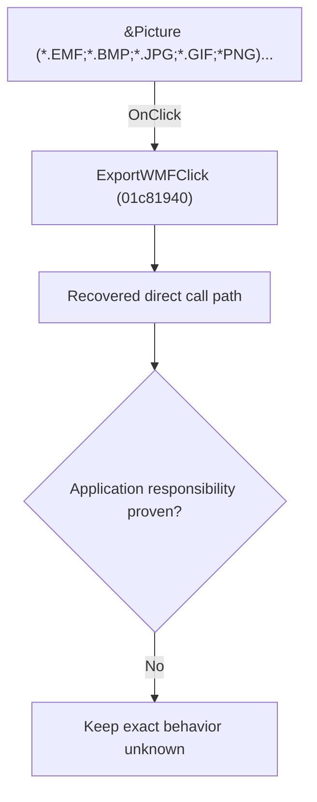

# &Picture (*.EMF;*.BMP;*.JPG;*.GIF;*PNG)...

> Analysis status: Blocked by an exact evidence gap.

## Control

| Property | Recovered value |
| --- | --- |
| Form | SchematicEditor |
| Component path | SchematicEditor.MainMenu.mnFile.Export.ExportWMF |
| Control class | TMenuItem |
| Caption | &Picture (*.EMF;*.BMP;*.JPG;*.GIF;*PNG)... |
| Hint | Not present in the recovered resource. |
| Text | Not present in the recovered resource. |
| Handler name | ExportWMFClick |
| Handler address | 01c81940 |
| Graph node | `resource:dfm:SchematicEditor/SchematicEditor.MainMenu.mnFile.Export.ExportWMF` |
| Handler node | `function:01c81940` |
| Graph layer | UI |

## What happens when clicked

The OnClick binding reaches ExportWMFClick at 01c81940. The recovered body has 10 distinct outgoing graph call(s), but the application-specific responsibilities and data effects of its downstream path are not established in the accepted graph evidence. The control's caption or name indicates user intent only; it is not enough to claim implementation behavior.

## Click flow

## Handler evidence

- Source: [DecompiledSources/Tina16/functions/0000000001C81940__FUN_01c81940.c](../../../DecompiledSources/Tina16/functions/0000000001C81940__FUN_01c81940.c)
- Recovered role: Evidence-blocked ExportWMFClick command.
- Current graph summary: Handles 1 Delphi UI event: SchematicEditor.MainMenu.mnFile.Export.ExportWMF.OnClick.
- Current graph behavior: The OnClick binding reaches ExportWMFClick at 01c81940. The recovered body has 10 distinct outgoing graph call(s), but the application-specific responsibilities and data effects of its downstream path are not established in the accepted graph evidence. The control's caption or name indicates user intent only; it is not enough to claim implementation behavior.
- Current graph evidence: The DFM binds SchematicEditor.MainMenu.mnFile.Export.ExportWMF to ExportWMFClick. The recovered source is DecompiledSources/Tina16/functions/0000000001C81940__FUN_01c81940.c and directly references 00414480, 00414560, 00416ad0, 004414c0, 00441640, 00441920, 00724270, 00724300, and 2 more. No accepted end-to-end role was established for this control path.
- Complexity: complex
- Distinct outgoing calls: 10

## Direct calls

- `function:00414480` — Delphi UnicodeString clear and finalization helper
- `function:00414560` — Delphi UnicodeString array finalization helper
- `function:00416ad0` — FUN_00416ad0
- `function:004414c0` — FUN_004414c0
- `function:00441640` — FUN_00441640
- `function:00441920` — FUN_00441920
- `function:00724270` — FUN_00724270
- `function:00724300` — FUN_00724300
- `function:00724380` — FUN_00724380
- `function:01c814e0` — FUN_01c814e0

## Resource evidence

- Kind: Not present in the recovered resource.
- Modal result: Not present in the recovered resource.
- Checked state: Not present in the recovered resource.
- List items: Not present in the recovered resource.
- Image reference: Not present in the recovered resource.
- Extracted glyph: None.

## Nearby label candidates

Nearby labels are layout candidates only. They are not proof of behavior.

- No same-parent label candidate is available.

## Analysis limits

- Exact gap: the recovered handler or one of its direct application callees lacks a source-supported role that proves the command's decisions, state changes, and output. Keep this Bead open until those callees are traced.

