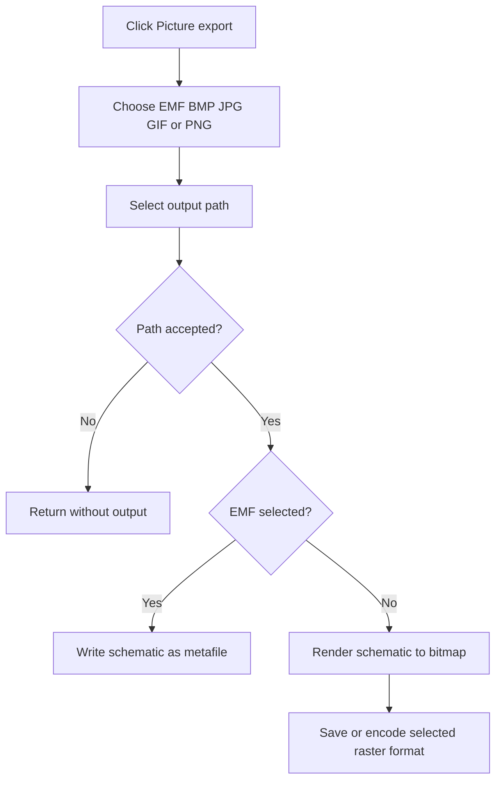

# &Picture (*.EMF;*.BMP;*.JPG;*.GIF;*PNG)...

> Analysis status: Reviewed from the format-selection, render, and image-encoder paths.

## Control

| Property | Recovered value |
| --- | --- |
| Form | SchematicEditor |
| Component path | SchematicEditor.MainMenu.mnFile.Export.ExportWMF |
| Control class | TMenuItem |
| Caption | &Picture (*.EMF;*.BMP;*.JPG;*.GIF;*PNG)... |
| Hint | Not present in the recovered resource. |
| Text | Not present in the recovered resource. |
| Handler name | ExportWMFClick |
| Handler address | 01c81940 |
| Graph node | `resource:dfm:SchematicEditor/SchematicEditor.MainMenu.mnFile.Export.ExportWMF` |
| Handler node | `function:01c81940` |
| Graph layer | UI |

## What happens when clicked

The handler opens a Save dialog for the active schematic picture. The selected filter chooses EMF, BMP, JPG, GIF, or PNG and the handler adds the matching extension. Cancel produces no file. After acceptance, the export helper writes EMF from the active schematic drawing bounds. For the raster formats, it renders the active schematic to a bitmap. It saves BMP directly or wraps the bitmap in the selected JPEG, GIF, or PNG encoder before it writes the file.

## Click flow

## Handler evidence

- Source: [DecompiledSources/Tina16/functions/0000000001C81940__FUN_01c81940.c](../../../DecompiledSources/Tina16/functions/0000000001C81940__FUN_01c81940.c)
- Recovered role: Export the active schematic as an EMF or raster image.
- Current graph summary: Handles 1 Delphi UI event: SchematicEditor.MainMenu.mnFile.Export.ExportWMF.OnClick.
- Current graph behavior: Selects an image format, collects a path, and writes the active schematic as EMF, BMP, JPG, GIF, or PNG.
- Current graph evidence: `FUN_01c81940` maps filter indexes 1 through 5 to the five extensions and calls `FUN_01c814e0` only after the Save dialog accepts. `FUN_01c814e0` uses the active schematic bounds and drawing path for EMF. For other formats it renders a bitmap, saves BMP directly, or constructs the matching JPEG, GIF, or PNG encoder before saving.
- Complexity: complex
- Distinct outgoing calls: 10

## Direct calls

- `function:00414480` — Delphi UnicodeString clear and finalization helper
- `function:00414560` — Delphi UnicodeString array finalization helper
- `function:00416ad0` — FUN_00416ad0
- `function:004414c0` — FUN_004414c0
- `function:00441640` — FUN_00441640
- `function:00441920` — FUN_00441920
- `function:00724270` — FUN_00724270
- `function:00724300` — FUN_00724300
- `function:00724380` — FUN_00724380
- `function:01c814e0` — FUN_01c814e0

## Resource evidence

- Kind: Not present in the recovered resource.
- Modal result: Not present in the recovered resource.
- Checked state: Not present in the recovered resource.
- List items: Not present in the recovered resource.
- Image reference: Not present in the recovered resource.
- Extracted glyph: None.

## Nearby label candidates

Nearby labels are layout candidates only. They are not proof of behavior.

- No same-parent label candidate is available.

## Analysis limits

- The menu caption lists `*PNG` without a dot, but the recovered handler appends the `.PNG` extension.
- This handler has no local file-write error branch.

