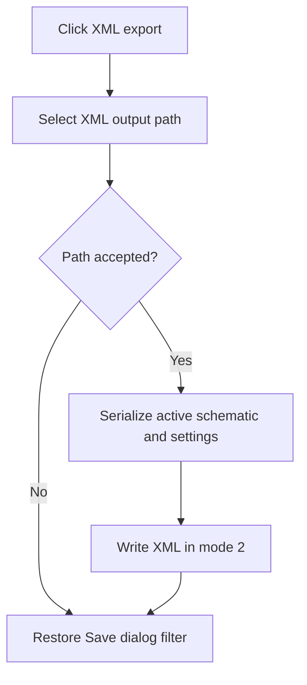

# XML...

> Analysis status: Reviewed from the Save-dialog, serializer, and XML writer paths.

## Control

| Property | Recovered value |
| --- | --- |
| Form | SchematicEditor |
| Component path | SchematicEditor.MainMenu.mnFile.Export.ExportXML |
| Control class | TMenuItem |
| Caption | XML... |
| Hint | Not present in the recovered resource. |
| Text | Not present in the recovered resource. |
| Handler name | ExportXMLClick |
| Handler address | 01ca30f0 |
| Graph node | `resource:dfm:SchematicEditor/SchematicEditor.MainMenu.mnFile.Export.ExportXML` |
| Handler node | `function:01ca30f0` |
| Graph layer | UI |

## What happens when clicked

The handler configures the shared Save dialog for an XML file and proposes a path from the active schematic. Cancel produces no file. After acceptance, it creates a serializer, copies the active schematic settings into the export document, serializes the schematic, and writes the XML to the selected path in mode 2. It restores the Save dialog's previous filter before it returns.

## Click flow

## Handler evidence

- Source: [DecompiledSources/Tina16/functions/0000000001CA30F0__FUN_01ca30f0.c](../../../DecompiledSources/Tina16/functions/0000000001CA30F0__FUN_01ca30f0.c)
- Recovered role: Serialize the active schematic to a selected XML file.
- Current graph summary: Handles 1 Delphi UI event: SchematicEditor.MainMenu.mnFile.Export.ExportXML.OnClick.
- Current graph behavior: Collects an XML path, serializes the current schematic and its settings, writes the XML, and restores shared dialog state.
- Current graph evidence: `FUN_01ca30f0` configures the dialog at editor offset `+0xb40` for `XML File|*.XML` and branches on its execute result. The accepted branch constructs a document and serializer, copies the active settings, calls `FUN_0128ee00`, and invokes virtual slot `+0x180` with the selected path and mode 2. The original filter is copied back before return.
- Complexity: complex
- Distinct outgoing calls: 15

## Direct calls

- `function:00414480` — Delphi UnicodeString clear and finalization helper
- `function:00414560` — Delphi UnicodeString array finalization helper
- `function:00414ad0` — Delphi UnicodeString assignment helper
- `function:00414b50` — FUN_00414b50
- `function:00416ad0` — FUN_00416ad0
- `function:00416ba0` — FUN_00416ba0
- `function:00417c40` — FUN_00417c40
- `function:0041b800` — FUN_0041b800
- `function:004414c0` — FUN_004414c0
- `function:00441640` — FUN_00441640
- `function:00441920` — FUN_00441920
- `function:00724270` — FUN_00724270
- `function:00724380` — FUN_00724380
- `function:00bac3d0` — FUN_00bac3d0
- `function:0128ee00` — FUN_0128ee00

## Resource evidence

- Kind: Not present in the recovered resource.
- Modal result: Not present in the recovered resource.
- Checked state: Not present in the recovered resource.
- List items: Not present in the recovered resource.
- Image reference: Not present in the recovered resource.
- Extracted glyph: None.

## Nearby label candidates

Nearby labels are layout candidates only. They are not proof of behavior.

- No same-parent label candidate is available.

## Analysis limits

- The XML writer's virtual method does not have a recovered Delphi name.
- This handler has no local file-write error branch.

