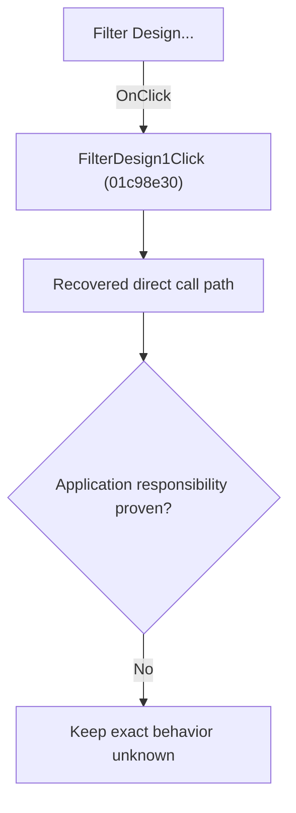

# Filter Design...

> Analysis status: Blocked by an exact evidence gap.

## Control

| Property | Recovered value |
| --- | --- |
| Form | SchematicEditor |
| Component path | SchematicEditor.MainMenu.mnTools.FilterDesign1 |
| Control class | TMenuItem |
| Caption | Filter Design... |
| Hint | Not present in the recovered resource. |
| Text | Not present in the recovered resource. |
| Handler name | FilterDesign1Click |
| Handler address | 01c98e30 |
| Graph node | `resource:dfm:SchematicEditor/SchematicEditor.MainMenu.mnTools.FilterDesign1` |
| Handler node | `function:01c98e30` |
| Graph layer | UI |

## What happens when clicked

The OnClick binding reaches FilterDesign1Click at 01c98e30. The recovered body has 5 distinct outgoing graph call(s), but the application-specific responsibilities and data effects of its downstream path are not established in the accepted graph evidence. The control's caption or name indicates user intent only; it is not enough to claim implementation behavior.

## Click flow

## Handler evidence

- Source: [DecompiledSources/Tina16/functions/0000000001C98E30__FUN_01c98e30.c](../../../DecompiledSources/Tina16/functions/0000000001C98E30__FUN_01c98e30.c)
- Recovered role: Evidence-blocked FilterDesign1Click command.
- Current graph summary: Handles 1 Delphi UI event: SchematicEditor.MainMenu.mnTools.FilterDesign1.OnClick.
- Current graph behavior: The OnClick binding reaches FilterDesign1Click at 01c98e30. The recovered body has 5 distinct outgoing graph call(s), but the application-specific responsibilities and data effects of its downstream path are not established in the accepted graph evidence. The control's caption or name indicates user intent only; it is not enough to claim implementation behavior.
- Current graph evidence: The DFM binds SchematicEditor.MainMenu.mnTools.FilterDesign1 to FilterDesign1Click. The recovered source is DecompiledSources/Tina16/functions/0000000001C98E30__FUN_01c98e30.c and directly references 00742eb0, 007fc180, 00800700, 00805990, 008059a0. No accepted end-to-end role was established for this control path.
- Complexity: complex
- Distinct outgoing calls: 5

## Direct calls

- `function:00742eb0` — FUN_00742eb0
- `function:007fc180` — FUN_007fc180
- `function:00800700` — FUN_00800700
- `function:00805990` — FUN_00805990
- `function:008059a0` — FUN_008059a0

## Resource evidence

- Kind: Not present in the recovered resource.
- Modal result: Not present in the recovered resource.
- Checked state: Not present in the recovered resource.
- List items: Not present in the recovered resource.
- Image reference: Not present in the recovered resource.
- Extracted glyph: None.

## Nearby label candidates

Nearby labels are layout candidates only. They are not proof of behavior.

- No same-parent label candidate is available.

## Analysis limits

- Exact gap: the recovered handler or one of its direct application callees lacks a source-supported role that proves the command's decisions, state changes, and output. Keep this Bead open until those callees are traced.

