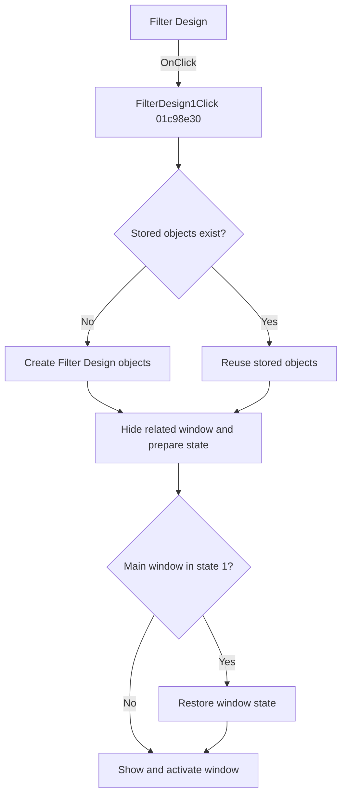

# Filter Design...

> Analysis status: Reviewed from recovered source and resource evidence.

## Control

| Property | Recovered value |
| --- | --- |
| Form | SchematicEditor |
| Component path | SchematicEditor.MainMenu.mnTools.FilterDesign1 |
| Control class | TMenuItem |
| Caption | Filter Design... |
| Handler | FilterDesign1Click at `01c98e30` |
| Graph node | `resource:dfm:SchematicEditor/SchematicEditor.MainMenu.mnTools.FilterDesign1` |

## What happens when clicked

The click opens the persistent Filter Design window. The handler lazily creates the main window and four related singleton objects when their global slots are empty. It hides one related window, clears an enabled-state field on one related control, restores the main window from state `1` when necessary, and then shows and activates the main window.

Later clicks reuse the stored objects. They do not create a second Filter Design window.

## Click flow

## Handler evidence

- [Handler source](../../../DecompiledSources/Tina16/functions/0000000001C98E30__FUN_01c98e30.c) proves the five lazy singleton checks, state preparation, restore branch, and final show call.
- [Show helper](../../../DecompiledSources/Tina16/functions/00000000008059A0__FUN_008059a0.c) makes a form visible and activates it.
- [Hide helper](../../../DecompiledSources/Tina16/functions/0000000000805990__FUN_00805990.c) makes the related form invisible.
- The recovered DFM contains `TFilterDesign` with caption `Filter Design`, its parameter editors, type selectors, Save, Load, Defaults, and OK controls.

## Analysis limits

- The four related singleton classes do not have recovered Delphi class names in this call path.
