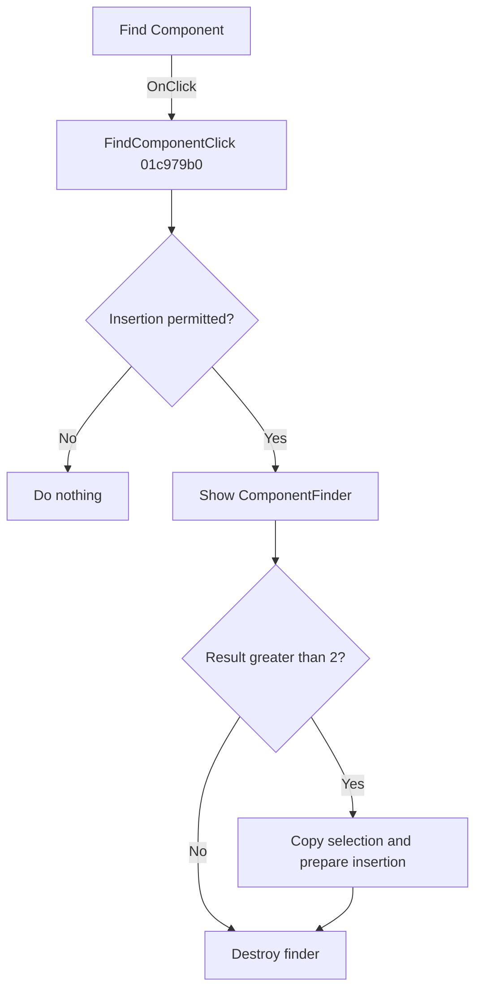

# &Find Component...

> Analysis status: Reviewed from recovered source and resource evidence.

## Control

| Property | Recovered value |
| --- | --- |
| Form | SchematicEditor |
| Component path | SchematicEditor.MainMenu.mnTools.FindComponent |
| Control class | TMenuItem |
| Caption | &Find Component... |
| Handler | FindComponentClick at `01c979b0` |
| Graph node | `resource:dfm:SchematicEditor/SchematicEditor.MainMenu.mnTools.FindComponent` |

## What happens when clicked

The click first checks whether component insertion is permitted. If the guard at `01c8cee0` reports a blocked editor state, the handler does nothing.

Otherwise, it creates and shows the modal `ComponentFinder` form. A result of `2` or less ends the command without preparing an insertion. A higher result selects the current list row, copies its component name and metadata into the Schematic Editor insertion fields, and chooses the normal or special component-creation path from the selected record flag. When a schematic model is available, it also builds or copies the selected component record, normalizes it, updates the shared component metadata, and prepares the new item for placement. The handler always destroys the modal form before it returns.

## Click flow

## Handler evidence

- [Handler source](../../../DecompiledSources/Tina16/functions/0000000001C979B0__FUN_01c979b0.c) proves the guard, modal result test, selected-row reads, state copies, branch-specific creation, model update, and cleanup.
- [Guard source](../../../DecompiledSources/Tina16/functions/0000000001C8CEE0__FUN_01c8cee0.c) returns a blocking value for specific active-editor and global states.
- The recovered `TComponentFinder` DFM has caption `Find Component`, a search editor, pattern options, a read-only results list, an Insert button, and a Cancel button.
- [Insertion helper](../../../DecompiledSources/Tina16/functions/0000000001C6EC30__FUN_01c6ec30.c) prepares and places the selected component when the editor state permits it.

## Analysis limits

- Several selected-row fields and the special type code `57` do not have recovered Delphi names.
