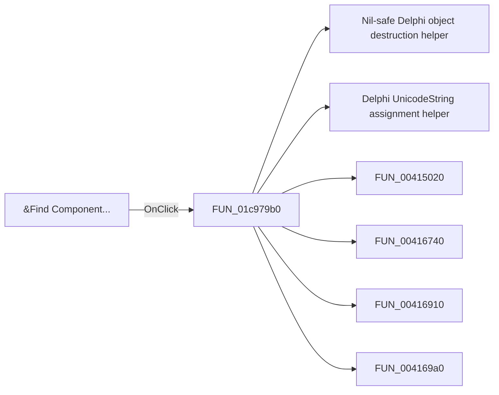

# &Find Component...

> Analysis status: Pending individual source review.

## Control

| Property | Recovered value |
| --- | --- |
| Form | SchematicEditor |
| Component path | SchematicEditor.MainMenu.mnTools.FindComponent |
| Control class | TMenuItem |
| Caption | &Find Component... |
| Hint | Not present in the recovered resource. |
| Text | Not present in the recovered resource. |
| Handler name | FindComponentClick |
| Handler address | 01c979b0 |
| Graph node | `resource:dfm:SchematicEditor/SchematicEditor.MainMenu.mnTools.FindComponent` |
| Handler node | `function:01c979b0` |
| Graph layer | UI |

## What happens when clicked

Pending individual analysis. An agent must read the recovered handler source and its relevant callees before it replaces this text.

## Click flow

## Handler evidence

- Source: [DecompiledSources/Tina16/functions/0000000001C979B0__FUN_01c979b0.c](../../../DecompiledSources/Tina16/functions/0000000001C979B0__FUN_01c979b0.c)
- Recovered role: Not present in the recovered resource.
- Current graph summary: Handles 1 Delphi UI event: SchematicEditor.MainMenu.mnTools.FindComponent.OnClick.
- Current graph behavior: Not present in the recovered resource.
- Current graph evidence: Not present in the recovered resource.
- Complexity: complex
- Distinct outgoing calls: 17

## Direct calls

- `function:00410f20` — Nil-safe Delphi object destruction helper
- `function:00414ad0` — Delphi UnicodeString assignment helper
- `function:00415020` — FUN_00415020
- `function:00416740` — FUN_00416740
- `function:00416910` — FUN_00416910
- `function:004169a0` — FUN_004169a0
- `function:00442bd0` — FUN_00442bd0
- `function:006efcb0` — FUN_006efcb0
- `function:007fc180` — FUN_007fc180
- `function:016ffb50` — FUN_016ffb50
- `function:0172cc40` — FUN_0172cc40
- `function:0172d840` — FUN_0172d840
- `function:0172f320` — FUN_0172f320
- `function:01c6ec30` — FUN_01c6ec30
- `function:01c8cee0` — FUN_01c8cee0
- `function:01d07850` — FUN_01d07850
- `function:01d37030` — FUN_01d37030

## Resource evidence

- Kind: Not present in the recovered resource.
- Modal result: Not present in the recovered resource.
- Checked state: Not present in the recovered resource.
- List items: Not present in the recovered resource.
- Image reference: Not present in the recovered resource.
- Extracted glyph: None.

## Nearby label candidates

Nearby labels are layout candidates only. They are not proof of behavior.

- No same-parent label candidate is available.

## Analysis limits

- Do not infer behavior from the control class, caption, hint, glyph, or nearby label alone.
- Do not replace the pending status until the handler source and relevant call path provide enough evidence.
