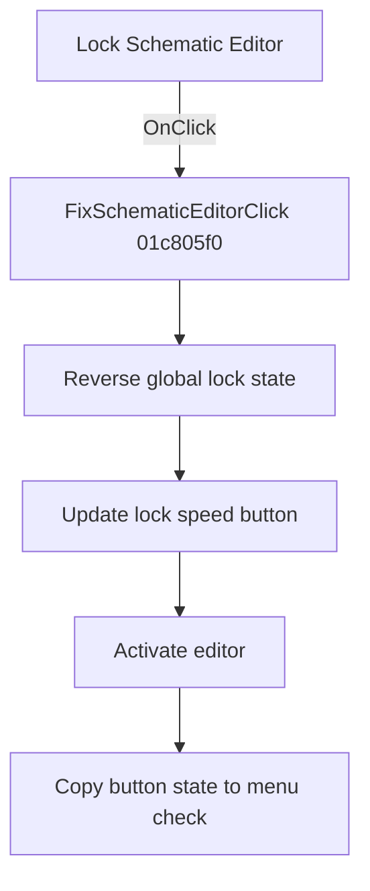

# &Lock Schematic Editor

> Analysis status: Reviewed from recovered source and resource evidence.

## Control

| Property | Recovered value |
| --- | --- |
| Form | SchematicEditor |
| Component path | SchematicEditor.MainMenu.mnTools.FixSchematicEditor |
| Control class | TMenuItem |
| Caption | &Lock Schematic Editor |
| Checked | true in the recovered resource |
| Handler | FixSchematicEditorClick at `01c805f0` |
| Graph node | `resource:dfm:SchematicEditor/SchematicEditor.MainMenu.mnTools.FixSchematicEditor` |

## What happens when clicked

The click toggles the Schematic Editor lock state. `FixSchematicEditorClick` delegates to the same `01ca0c80` routine that handles the status-panel lock button.

That routine reverses global byte `01fe7778`, updates the lock speed button with the inverse value, activates the editor, and copies the button state at offset `328` to the menu item's checked state. Thus, the menu item and lock button stay synchronized after each click.

## Click flow

## Handler evidence

- [Handler source](../../../DecompiledSources/Tina16/functions/0000000001C805F0__FUN_01c805f0.c) delegates directly to `01ca0c80`.
- [Toggle source](../../../DecompiledSources/Tina16/functions/0000000001CA0C80__FUN_01ca0c80.c) proves the global toggle and the two synchronized control updates.
- The parallel `sbEditorLocked` control binds directly to `01ca0c80`. Its hint is `Lock Schematic|Locks/unlocks the schematic editor at the bottom`.
- The parallel button has an [extracted 21 by 15 pixel lock glyph](../../../glyph/0376_SchematicEditor_SchematicEditor_StatusPanel_ButtonPanel_EditorLockPanel_sbEditorLocked_Glyph_Data.png).

## Analysis limits

- The recovered source does not give a Delphi name for global byte `01fe7778`.
