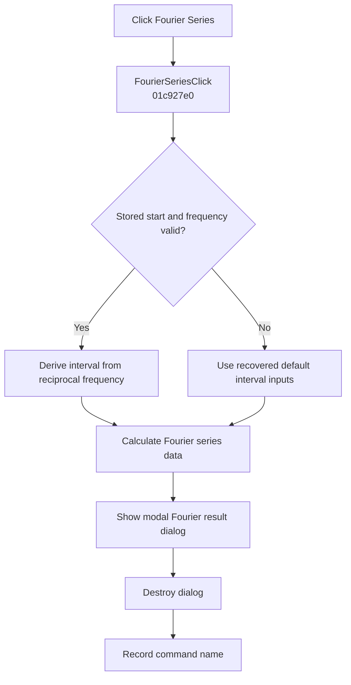

# Fourier &Series...

> Analysis status: Complete. The handler selects the Fourier interval, prepares series data, opens the modal result dialog, and records the command.

## Control

| Property | Recovered value |
| --- | --- |
| Form | SchematicEditor |
| Component path | SchematicEditor.MainMenu.mnAnalysis.FourierAnalysis.FourierSeries |
| Control class | TMenuItem |
| Caption | Fourier &Series... |
| Hint | Not present in the recovered resource. |
| Text | Not present in the recovered resource. |
| Handler name | FourierSeriesClick |
| Handler address | 01c927e0 |
| Graph node | `resource:dfm:SchematicEditor/SchematicEditor.MainMenu.mnAnalysis.FourierAnalysis.FourierSeries` |
| Handler node | `function:01c927e0` |
| Graph layer | UI |

## What happens when clicked

`FUN_01c927e0` passes the active schematic to `FUN_01143a60`. That routine chooses a recovered time interval from global Fourier settings. If the stored start or frequency is invalid, it uses the recovered default interval inputs. Otherwise, it derives the interval from the start time and reciprocal frequency.

The routine calculates Fourier-series data, prepares the series range, creates the Fourier result dialog, shows it modally, ignores the modal result, and destroys it. After the routine returns, the handler records `FourierSeriesClick`.

## Click flow

## Handler evidence

- Source: [DecompiledSources/Tina16/functions/0000000001C927E0__FUN_01c927e0.c](../../../DecompiledSources/Tina16/functions/0000000001C927E0__FUN_01c927e0.c)
- Recovered role: Calculates Fourier-series data and opens its modal result dialog.
- Current graph summary: Handles 1 Delphi UI event: SchematicEditor.MainMenu.mnAnalysis.FourierAnalysis.FourierSeries.OnClick.
- Current graph behavior: Selects a Fourier interval from global settings or defaults, calculates series data, shows and destroys the modal result dialog, and records the command.
- Current graph evidence: `FUN_01c927e0` calls `FUN_01143a60` with the active schematic. That callee branches on the stored start and frequency, calls the Fourier data builders, constructs the class at `PTR_FUN_0113f968`, dispatches `ShowModal`, and destroys it. The NetlistEditor Fourier Series command uses the same callee.
- Complexity: moderate
- Distinct outgoing calls: 2

## Direct calls

- `function:00414ad0` — Records the command name
- `function:01143a60` — Selects the interval, calculates Fourier-series data, and owns the modal result dialog

## Resource evidence

- Kind: Not present in the recovered resource.
- Modal result: Not present in the recovered resource.
- Checked state: Not present in the recovered resource.
- List items: Not present in the recovered resource.
- Image reference: Not present in the recovered resource.
- Extracted glyph: None.

## Nearby label candidates

Nearby labels are layout candidates only. They are not proof of behavior.

- No same-parent label candidate is available.

## Analysis limits

- The modal result is ignored by the wrapper.
- The recovered source does not name the dialog class or expose each displayed series field.
