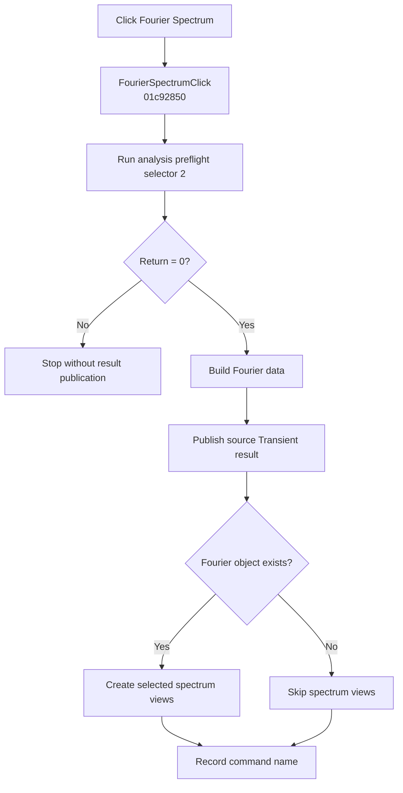

# Fourier S&pectrum...

> Analysis status: Complete. A zero preflight result builds Fourier data, publishes the base result, and creates selected spectrum views.

## Control

| Property | Recovered value |
| --- | --- |
| Form | SchematicEditor |
| Component path | SchematicEditor.MainMenu.mnAnalysis.FourierAnalysis.FourierSpectrum |
| Control class | TMenuItem |
| Caption | Fourier S&pectrum... |
| Hint | Not present in the recovered resource. |
| Text | Not present in the recovered resource. |
| Handler name | FourierSpectrumClick |
| Handler address | 01c92850 |
| Graph node | `resource:dfm:SchematicEditor/SchematicEditor.MainMenu.mnAnalysis.FourierAnalysis.FourierSpectrum` |
| Handler node | `function:01c92850` |
| Graph layer | UI |

## What happens when clicked

`FUN_01c92850` runs `FUN_01349310` with analysis selector `2`. A nonzero return stops the handler before Fourier data or result publication.

For a zero return, the handler builds Fourier data with `FUN_0114dc00` from the active circuit result and recovered global window settings. It stores that object in the shared result pointer, publishes the source Transient result through `FUN_013d2f60`, and, when the Fourier object is not null, passes it with the recovered display mask and settings to `FUN_013d99f0`. That routine creates the selected real, imaginary, power, or amplitude spectrum views. The handler then records `FourierSpectrumClick`.

## Click flow

## Handler evidence

- Source: [DecompiledSources/Tina16/functions/0000000001C92850__FUN_01c92850.c](../../../DecompiledSources/Tina16/functions/0000000001C92850__FUN_01c92850.c)
- Recovered role: Builds and publishes Fourier spectrum results after a successful preflight.
- Current graph summary: Handles 1 Delphi UI event: SchematicEditor.MainMenu.mnAnalysis.FourierAnalysis.FourierSpectrum.OnClick.
- Current graph behavior: Stops on a nonzero preflight result. Otherwise, builds Fourier data, publishes the source Transient result, creates selected spectrum views when the Fourier object exists, and records the command.
- Current graph evidence: The handler branches on `FUN_01349310(0,2,active,0)`, calls `FUN_0114dc00` only for zero, stores its result in `PTR_DAT_02001288`, calls the annotated Transient publisher, and conditionally calls `FUN_013d99f0`. The NetlistEditor and text-command paths use the same selector and publisher sequence.
- Complexity: complex
- Distinct outgoing calls: 5

## Direct calls

- `function:00414ad0` — Records the command name
- `function:0114dc00` — Builds Fourier data from the active result and global settings
- `function:01349310` — Prepares analysis selector 2 and returns a stop-or-continue status
- `function:013d2f60` — Publishes the source Transient result
- `function:013d99f0` — Creates the selected Fourier spectrum views

## Resource evidence

- Kind: Not present in the recovered resource.
- Modal result: Not present in the recovered resource.
- Checked state: Not present in the recovered resource.
- List items: Not present in the recovered resource.
- Image reference: Not present in the recovered resource.
- Extracted glyph: None.

## Nearby label candidates

Nearby labels are layout candidates only. They are not proof of behavior.

- No same-parent label candidate is available.

## Analysis limits

- The exact meanings of nonzero preflight results are not recovered.
- A null Fourier object still permits the source Transient publication; only the spectrum-view call is skipped.
- The handler has no local exception or rollback path.
