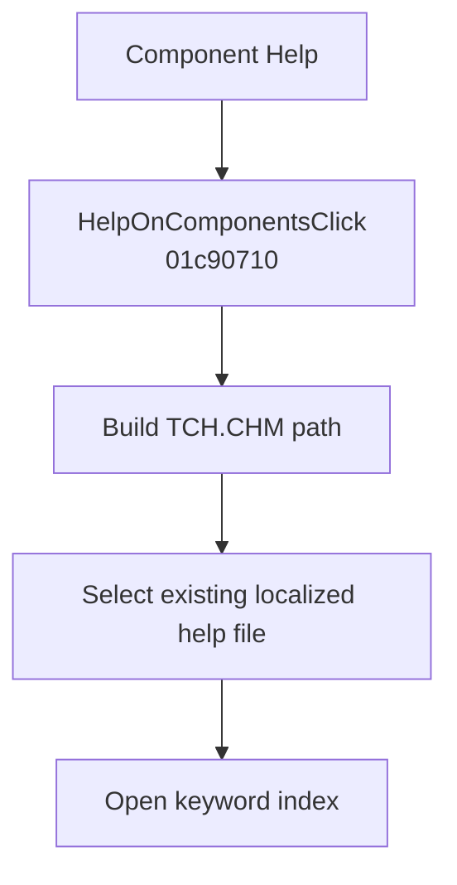

# C&omponent Help

> Analysis status: Evidence-backed behavior recovered.

## Control

| Property | Recovered value |
| --- | --- |
| Form | SchematicEditor |
| Component path | SchematicEditor.MainMenu.Help.HelpOnComponents |
| Control class | TMenuItem |
| Caption | C&omponent Help |
| Hint | Not present in the recovered resource. |
| Text | Not present in the recovered resource. |
| Handler name | HelpOnComponentsClick |
| Handler address | 01c90710 |
| Graph node | `resource:dfm:SchematicEditor/SchematicEditor.MainMenu.Help.HelpOnComponents` |
| Handler node | `function:01c90710` |
| Graph layer | UI |

## What happens when clicked

The handler builds a path to `TCH.CHM`, passes it to `FUN_01B1DEF0` to select an existing language-specific variant, and calls the application help-system method at virtual offset `0x30` with keyword `index`. It does not inspect a selected schematic component and does not change the model. Missing-file behavior is not present in this handler.

## Click flow

## Handler evidence

- Source: [DecompiledSources/Tina16/functions/0000000001C90710__FUN_01c90710.c](../../../DecompiledSources/Tina16/functions/0000000001C90710__FUN_01c90710.c)
- Recovered role: Opens the component-help index in localized TCH.CHM.
- Current graph summary: Handles 1 Delphi UI event: SchematicEditor.MainMenu.Help.HelpOnComponents.OnClick.
- Current graph behavior: The handler resolves localized `TCH.CHM` and opens the keyword `index` through the help system.
- Current graph evidence: The file and keyword literals, localization helper, and virtual keyword-help call are direct recovered source values.
- Complexity: complex
- Distinct outgoing calls: 3

## Direct calls

- `function:00414480` — Delphi UnicodeString clear and finalization helper
- `function:00416cd0` — FUN_00416cd0
- `function:01b1def0` — FUN_01b1def0

## Resource evidence

- Kind: Not present in the recovered resource.
- Modal result: Not present in the recovered resource.
- Checked state: Not present in the recovered resource.
- List items: Not present in the recovered resource.
- Image reference: Not present in the recovered resource.
- Extracted glyph: None.

## Nearby label candidates

Nearby labels are layout candidates only. They are not proof of behavior.

- No same-parent label candidate is available.

## Analysis limits

- Despite the menu caption, the handler opens the general component-help index; it does not pass a selected component identifier.

