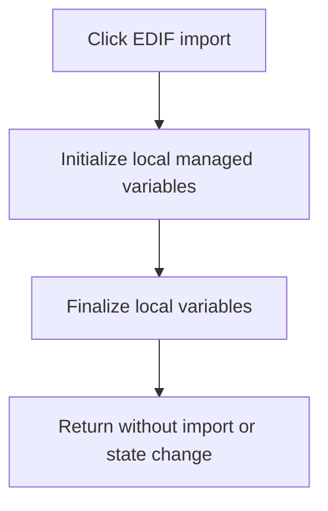

# EDIF (*.EDF)...

> Analysis status: Reviewed as a recovered no-op handler.

## Control

| Property | Recovered value |
| --- | --- |
| Form | SchematicEditor |
| Component path | SchematicEditor.MainMenu.mnFile.Import.ImportEDIF |
| Control class | TMenuItem |
| Caption | EDIF (*.EDF)... |
| Hint | Not present in the recovered resource. |
| Text | Not present in the recovered resource. |
| Handler name | ImportEDIFClick |
| Handler address | 01c834c0 |
| Graph node | `resource:dfm:SchematicEditor/SchematicEditor.MainMenu.mnFile.Import.ImportEDIF` |
| Handler node | `function:01c834c0` |
| Graph layer | UI |

## What happens when clicked

The click has no application effect in the recovered executable. The handler initializes and finalizes local managed variables, then returns. It does not open a file dialog, call an EDIF parser, write editor state, or create an output. The EDIF caption states intended UI purpose, but the recovered implementation is a no-op.

## Click flow

## Handler evidence

- Source: [DecompiledSources/Tina16/functions/0000000001C834C0__FUN_01c834c0.c](../../../DecompiledSources/Tina16/functions/0000000001C834C0__FUN_01c834c0.c)
- Recovered role: No-op EDIF import menu handler.
- Current graph summary: Handles 1 Delphi UI event: SchematicEditor.MainMenu.mnFile.Import.ImportEDIF.OnClick.
- Current graph behavior: Performs only managed-local initialization and cleanup, then returns without an EDIF import.
- Current graph evidence: `FUN_01c834c0` contains calls only to `FUN_0041b800` and `FUN_00414560`, which initialize and finalize local managed values. The recovered body has no dialog, parser, document, file-write, or state-consumer call.
- Complexity: moderate
- Distinct outgoing calls: 2

## Direct calls

- `function:00414560` — Delphi UnicodeString array finalization helper
- `function:0041b800` — FUN_0041b800

## Resource evidence

- Kind: Not present in the recovered resource.
- Modal result: Not present in the recovered resource.
- Checked state: Not present in the recovered resource.
- List items: Not present in the recovered resource.
- Image reference: Not present in the recovered resource.
- Extracted glyph: None.

## Nearby label candidates

Nearby labels are layout candidates only. They are not proof of behavior.

- No same-parent label candidate is available.

## Analysis limits

- This conclusion applies to the recovered TINA executable. The resource caption does not prove that another build implements EDIF import.

