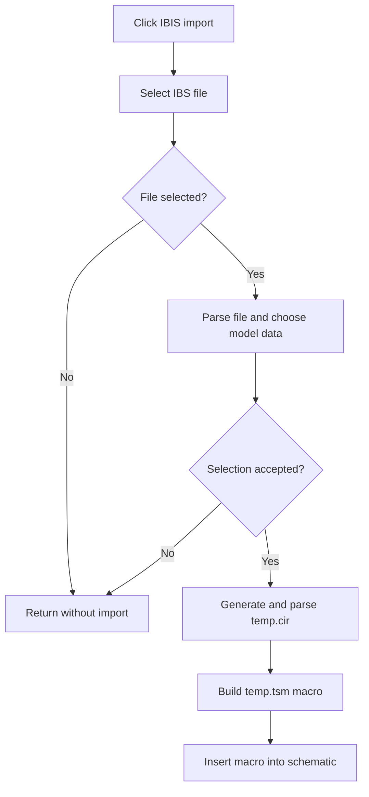

# IBIS File (*.IBS)...

> Analysis status: Reviewed from the IBIS file, selection-dialog, circuit-generation, and placement paths.

## Control

| Property | Recovered value |
| --- | --- |
| Form | SchematicEditor |
| Component path | SchematicEditor.MainMenu.mnFile.Import.ImportIbis |
| Control class | TMenuItem |
| Caption | IBIS File (*.IBS)... |
| Hint | Not present in the recovered resource. |
| Text | Not present in the recovered resource. |
| Handler name | ImportIbisClick |
| Handler address | 01ca4a80 |
| Graph node | `resource:dfm:SchematicEditor/SchematicEditor.MainMenu.mnFile.Import.ImportIbis` |
| Handler node | `function:01ca4a80` |
| Graph layer | UI |

## What happens when clicked

The handler configures the Open dialog for an IBIS `*.IBS` file. Cancel produces no change. After file selection, it parses the file and opens `IbisImport` so that the user can select a component, signal, model, and Typ, Min, or Max data. A result other than acceptance stops the import. On acceptance, the dialog generates `temp.cir`. The follow-up path parses that circuit, builds a macro with recovered pins and model metadata, writes `temp.tsm` in the temporary directory, and passes the macro to the schematic insertion path.

## Click flow

## Handler evidence

- Source: [DecompiledSources/Tina16/functions/0000000001CA4A80__FUN_01ca4a80.c](../../../DecompiledSources/Tina16/functions/0000000001CA4A80__FUN_01ca4a80.c)
- Recovered role: Import a selected IBIS model as a placeable TINA macro.
- Current graph summary: Handles 1 Delphi UI event: SchematicEditor.MainMenu.mnFile.Import.ImportIbis.OnClick.
- Current graph behavior: Gets an IBS path, parses and stages the chosen model, generates a temporary circuit and macro, and sends the macro to schematic placement.
- Current graph evidence: `FUN_01ca4a80` configures the Open dialog for `IBIS File|*.IBS`, calls annotated controller `FUN_01ca4350`, and proceeds only when it returns true. That controller parses the input, opens `IbisImport`, and generates `temp.cir` for an accepted selection. `FUN_01ca4640` parses the generated circuit, collects pins, writes `temp.tsm`, and calls the recovered schematic insertion path `FUN_01c6ec30`.
- Complexity: complex
- Distinct outgoing calls: 6

## Direct calls

- `function:00414480` — Delphi UnicodeString clear and finalization helper
- `function:00414560` — Delphi UnicodeString array finalization helper
- `function:00414ad0` — Delphi UnicodeString assignment helper
- `function:00724270` — FUN_00724270
- `function:01ca4350` — FUN_01ca4350
- `function:01ca4640` — FUN_01ca4640

## Resource evidence

- Kind: Not present in the recovered resource.
- Modal result: Not present in the recovered resource.
- Checked state: Not present in the recovered resource.
- List items: Not present in the recovered resource.
- Image reference: Not present in the recovered resource.
- Extracted glyph: None.

## Nearby label candidates

Nearby labels are layout candidates only. They are not proof of behavior.

- No same-parent label candidate is available.

## Analysis limits

- Parser and generator failures below these recovered functions do not have a separate error branch in the menu handler.

