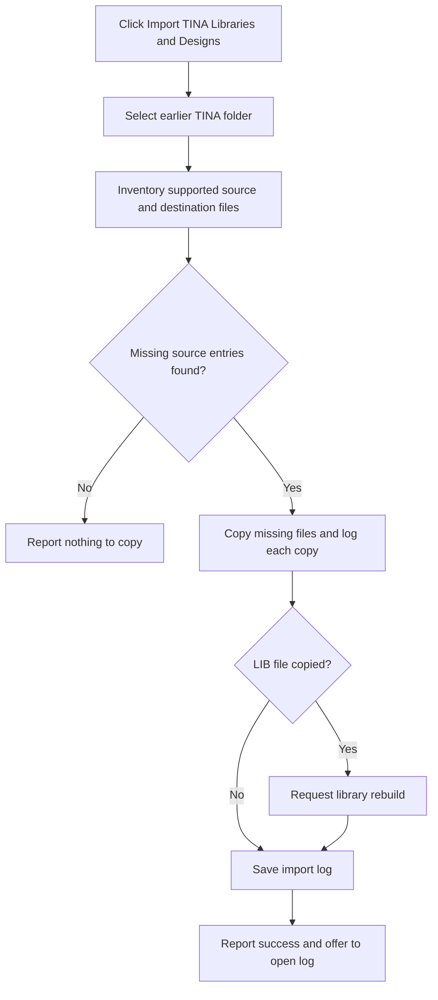

# Import TINA Libraries and Designs...

> Analysis status: Reviewed from the folder-selector, file-inventory, copy, rebuild, and log paths.

## Control

| Property | Recovered value |
| --- | --- |
| Form | SchematicEditor |
| Component path | SchematicEditor.MainMenu.mnFile.Import.ImportUserLibs |
| Control class | TMenuItem |
| Caption | Import TINA Libraries and Designs... |
| Hint | Not present in the recovered resource. |
| Text | Not present in the recovered resource. |
| Handler name | ImportUserLibsClick |
| Handler address | 01ca2ac0 |
| Graph node | `resource:dfm:SchematicEditor/SchematicEditor.MainMenu.mnFile.Import.ImportUserLibs` |
| Handler node | `function:01ca2ac0` |
| Graph layer | UI |

## What happens when clicked

The handler opens `frmSelectTinaFolder`. The dialog selects an earlier TINA installation and can include its examples and designs. Its Go button inventories supported catalog, footprint, 3D, macro, and SPICE library files. It optionally adds user-example designs. It compares these sources with the current TINA destinations and copies only missing entries. It logs each copy, requests a library rebuild when it copies a LIB file, saves `Library Import.log`, and reports either success or that there was nothing to copy. After success, it offers to open the log in Notepad.

## Click flow

## Handler evidence

- Source: [DecompiledSources/Tina16/functions/0000000001CA2AC0__FUN_01ca2ac0.c](../../../DecompiledSources/Tina16/functions/0000000001CA2AC0__FUN_01ca2ac0.c)
- Recovered role: Open the earlier-version TINA library and design migration dialog.
- Current graph summary: Handles 1 Delphi UI event: SchematicEditor.MainMenu.mnFile.Import.ImportUserLibs.OnClick.
- Current graph behavior: Shows the TINA-folder selector. Its Go path imports missing library and optional example files, writes a log, and requests a rebuild when required.
- Current graph evidence: `FUN_01ca2ac0` constructs the class that the resource and event map identify as `frmSelectTinaFolder`, shows it modally, and destroys it. The annotated `btnOK` handler at `01c454f0` inventories supported extensions, compares source and destination lists, copies absent entries, logs copies, writes `ForceReBuildLibrary` after a LIB copy, saves `Library Import.log`, and opens it through `notepad.exe` only when the user answers Yes.
- Complexity: moderate
- Distinct outgoing calls: 2

## Direct calls

- `function:00410f20` — Nil-safe Delphi object destruction helper
- `function:007fc180` — FUN_007fc180

## Resource evidence

- Kind: Not present in the recovered resource.
- Modal result: Not present in the recovered resource.
- Checked state: Not present in the recovered resource.
- List items: Not present in the recovered resource.
- Image reference: Not present in the recovered resource.
- Extracted glyph: None.

## Nearby label candidates

Nearby labels are layout candidates only. They are not proof of behavior.

- No same-parent label candidate is available.

## Analysis limits

- Copy failures are handled below the recovered stream-copy calls; this menu handler has no local error branch.

