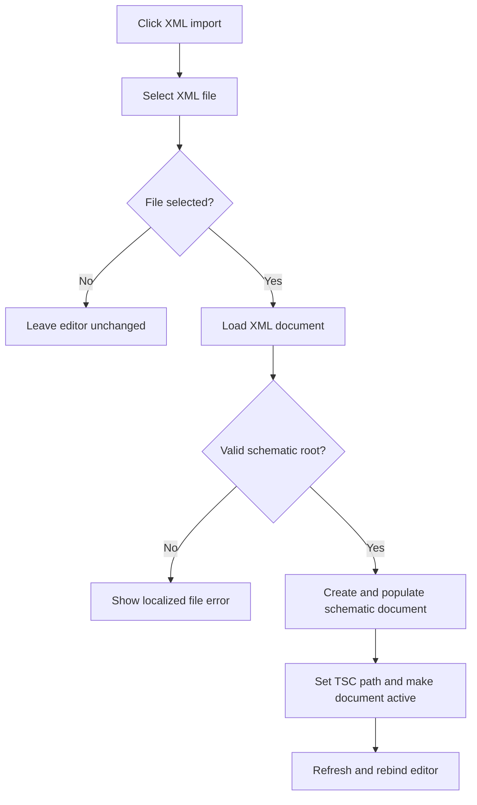

# XML...

> Analysis status: Reviewed from the XML loader, document creation, editor-rebind, and invalid-file paths.

## Control

| Property | Recovered value |
| --- | --- |
| Form | SchematicEditor |
| Component path | SchematicEditor.MainMenu.mnFile.Import.ImportXML |
| Control class | TMenuItem |
| Caption | XML... |
| Hint | Not present in the recovered resource. |
| Text | Not present in the recovered resource. |
| Handler name | ImportXMLClick |
| Handler address | 01ca35c0 |
| Graph node | `resource:dfm:SchematicEditor/SchematicEditor.MainMenu.mnFile.Import.ImportXML` |
| Handler node | `function:01ca35c0` |
| Graph layer | UI |

## What happens when clicked

The handler configures the Open dialog for an XML file. Cancel leaves the editor unchanged. After selection, it loads the XML into the recovered schematic serializer. A valid root creates a new schematic document, populates it from the XML, copies the global configuration, initializes the document, and makes it active. The handler derives a `.TSC` document path from the selected XML path and then refreshes and rebinds the editor. If the loader does not return a valid root, it shows a localized error that includes the selected file name.

## Click flow

## Handler evidence

- Source: [DecompiledSources/Tina16/functions/0000000001CA35C0__FUN_01ca35c0.c](../../../DecompiledSources/Tina16/functions/0000000001CA35C0__FUN_01ca35c0.c)
- Recovered role: Import an XML schematic as a new active TINA document.
- Current graph summary: Handles 1 Delphi UI event: SchematicEditor.MainMenu.mnFile.Import.ImportXML.OnClick.
- Current graph behavior: Loads a selected XML schematic, creates and activates a new schematic document on success, or reports an invalid file on failure.
- Current graph evidence: `FUN_01ca35c0` configures the Open dialog for `XML File|*.XML` and invokes the serializer load method at virtual slot `+0x170`. A valid root causes calls to `FUN_01293730` and `FUN_0199e310`, writes both active-document fields at `+0x27a8` and `+0x2788`, stores a derived `.TSC` path, and calls `FUN_01c7d780` and `FUN_01c8ab30`. The invalid branch loads message ID `0x593`, formats it with the selected name, and calls `FUN_016fd940`.
- Complexity: complex
- Distinct outgoing calls: 19

## Direct calls

- `function:00414480` — Delphi UnicodeString clear and finalization helper
- `function:00414560` — Delphi UnicodeString array finalization helper
- `function:00414ad0` — Delphi UnicodeString assignment helper
- `function:00417c40` — FUN_00417c40
- `function:0041b800` — FUN_0041b800
- `function:004414c0` — FUN_004414c0
- `function:00442f70` — FUN_00442f70
- `function:0065b870` — FUN_0065b870
- `function:00724270` — FUN_00724270
- `function:00b89270` — FUN_00b89270
- `function:00b8e520` — FUN_00b8e520
- `function:00bac3d0` — FUN_00bac3d0
- `function:01293730` — FUN_01293730
- `function:014a1260` — FUN_014a1260
- `function:016fd940` — FUN_016fd940
- `function:0198b200` — FUN_0198b200
- `function:0199e310` — FUN_0199e310
- `function:01c7d780` — FUN_01c7d780
- `function:01c8ab30` — FUN_01c8ab30

## Resource evidence

- Kind: Not present in the recovered resource.
- Modal result: Not present in the recovered resource.
- Checked state: Not present in the recovered resource.
- List items: Not present in the recovered resource.
- Image reference: Not present in the recovered resource.
- Extracted glyph: None.

## Nearby label candidates

Nearby labels are layout candidates only. They are not proof of behavior.

- No same-parent label candidate is available.

## Analysis limits

- The final localized text for message ID `0x593` is not present in the recovered handler.
- XML parser diagnostics below the serializer are not exposed by this menu path.

