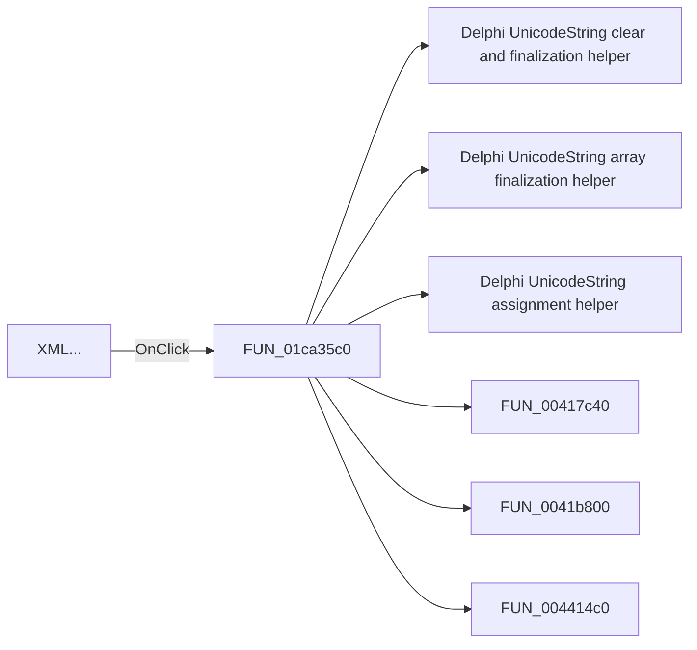

# XML...

> Analysis status: Pending individual source review.

## Control

| Property | Recovered value |
| --- | --- |
| Form | SchematicEditor |
| Component path | SchematicEditor.MainMenu.mnFile.Import.ImportXML |
| Control class | TMenuItem |
| Caption | XML... |
| Hint | Not present in the recovered resource. |
| Text | Not present in the recovered resource. |
| Handler name | ImportXMLClick |
| Handler address | 01ca35c0 |
| Graph node | `resource:dfm:SchematicEditor/SchematicEditor.MainMenu.mnFile.Import.ImportXML` |
| Handler node | `function:01ca35c0` |
| Graph layer | UI |

## What happens when clicked

Pending individual analysis. An agent must read the recovered handler source and its relevant callees before it replaces this text.

## Click flow

## Handler evidence

- Source: [DecompiledSources/Tina16/functions/0000000001CA35C0__FUN_01ca35c0.c](../../../DecompiledSources/Tina16/functions/0000000001CA35C0__FUN_01ca35c0.c)
- Recovered role: Not present in the recovered resource.
- Current graph summary: Handles 1 Delphi UI event: SchematicEditor.MainMenu.mnFile.Import.ImportXML.OnClick.
- Current graph behavior: Not present in the recovered resource.
- Current graph evidence: Not present in the recovered resource.
- Complexity: complex
- Distinct outgoing calls: 19

## Direct calls

- `function:00414480` — Delphi UnicodeString clear and finalization helper
- `function:00414560` — Delphi UnicodeString array finalization helper
- `function:00414ad0` — Delphi UnicodeString assignment helper
- `function:00417c40` — FUN_00417c40
- `function:0041b800` — FUN_0041b800
- `function:004414c0` — FUN_004414c0
- `function:00442f70` — FUN_00442f70
- `function:0065b870` — FUN_0065b870
- `function:00724270` — FUN_00724270
- `function:00b89270` — FUN_00b89270
- `function:00b8e520` — FUN_00b8e520
- `function:00bac3d0` — FUN_00bac3d0
- `function:01293730` — FUN_01293730
- `function:014a1260` — FUN_014a1260
- `function:016fd940` — FUN_016fd940
- `function:0198b200` — FUN_0198b200
- `function:0199e310` — FUN_0199e310
- `function:01c7d780` — FUN_01c7d780
- `function:01c8ab30` — FUN_01c8ab30

## Resource evidence

- Kind: Not present in the recovered resource.
- Modal result: Not present in the recovered resource.
- Checked state: Not present in the recovered resource.
- List items: Not present in the recovered resource.
- Image reference: Not present in the recovered resource.
- Extracted glyph: None.

## Nearby label candidates

Nearby labels are layout candidates only. They are not proof of behavior.

- No same-parent label candidate is available.

## Analysis limits

- Do not infer behavior from the control class, caption, hint, glyph, or nearby label alone.
- Do not replace the pending status until the handler source and relevant call path provide enough evidence.
