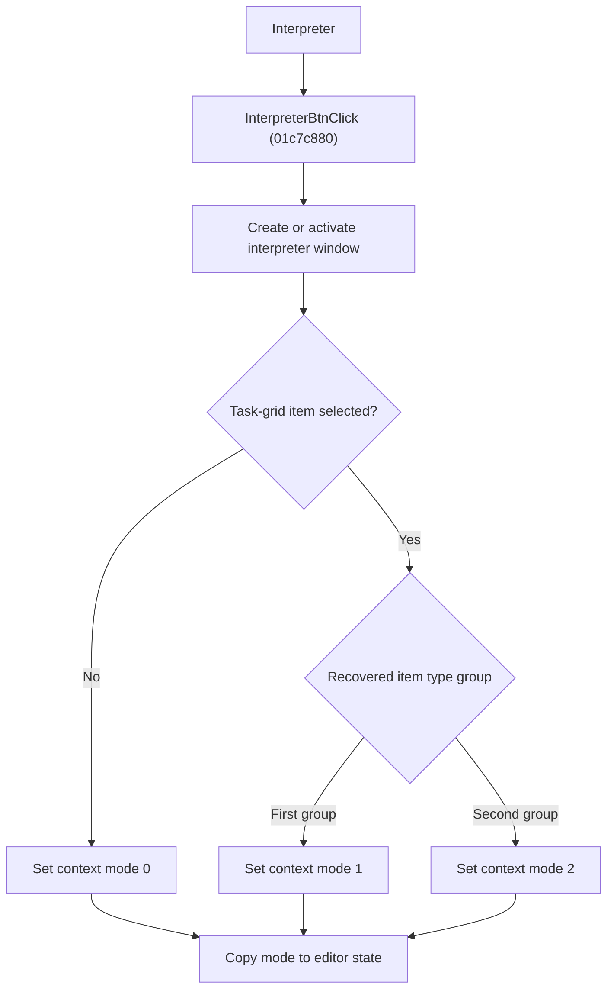

# Interpreter

> Analysis status: Reviewed from recovered source, callers, and glyph evidence.

## Control

| Property | Recovered value |
| --- | --- |
| Component path | SchematicEditor.EditorPanel.ExamPanel.ExamMainPages.tsCurTask.GroupBox2.InterpreterBtn |
| Control class | TBitBtn |
| Handler | InterpreterBtnClick at 01c7c880 |

## What happens when clicked

The handler creates the shared interpreter window when necessary, or brings its existing window to the front. It sends interpreter command `9`, reads the selected task-grid item, and sets an interpreter context byte from the selected item's type. No selection gives context `0`; the two recovered supported type groups give context `1` or `2`. It copies that context to the editor field later read when the simulation or interpreter model is rebuilt.

## Click flow

## Handler evidence

- Source: [FUN_01c7c880](../../../DecompiledSources/Tina16/functions/0000000001C7C880__FUN_01c7c880.c)
- [FUN_01c80630](../../../DecompiledSources/Tina16/functions/0000000001C80630__FUN_01c80630.c) constructs or activates the interpreter window and sends command `9` to its native handle.
- [FUN_01c7acf0](../../../DecompiledSources/Tina16/functions/0000000001C7ACF0__FUN_01c7acf0.c) resolves the selected row's model item.
- [FUN_017f17c0](../../../DecompiledSources/Tina16/functions/00000000017F17C0__FUN_017f17c0.c) later copies editor byte `0xb43` into interpreter-model byte `0x5f8`.
- Extracted glyph: [Interpreter glyph](../../../glyph/0360_SchematicEditor_SchematicEditor_EditorPanel_ExamPanel_ExamMainPages_tsCurTask_GroupBox2_InterpreterBtn_Glyph_Data.png)

## Analysis limits

- The recovered source does not provide Delphi enum names for context values `0`, `1`, and `2`. The article therefore does not assign domain names to them.
