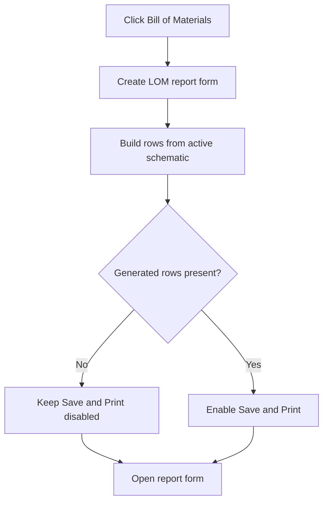

# Bill of Materials...

> Analysis status: Reviewed from the Bill of Materials form and report-grid builder.

## Control

| Property | Recovered value |
| --- | --- |
| Form | SchematicEditor |
| Component path | SchematicEditor.MainMenu.mnFile.ListofMaterials1 |
| Control class | TMenuItem |
| Caption | Bill of Materials... |
| Hint | Not present in the recovered resource. |
| Text | Not present in the recovered resource. |
| Handler name | ListofMaterials1Click |
| Handler address | 01c93d20 |
| Graph node | `resource:dfm:SchematicEditor/SchematicEditor.MainMenu.mnFile.ListofMaterials1` |
| Handler node | `function:01c93d20` |
| Graph layer | UI |

## What happens when clicked

The handler creates the `LOM` Bill of Materials form and immediately builds its report rows from the active schematic. The form settings select Label, Value, Footprint, and Parameter 1 through Parameter 4 columns, plus grouping and ordering options. The report builder fills the string grid and enables Save and Print only when the generated list is not empty. The form then opens modally and lets the user create, save, or print the report. The handler destroys it after it closes.

## Click flow

## Handler evidence

- Source: [DecompiledSources/Tina16/functions/0000000001C93D20__FUN_01c93d20.c](../../../DecompiledSources/Tina16/functions/0000000001C93D20__FUN_01c93d20.c)
- Recovered role: Build and show the Bill of Materials report for the active schematic.
- Current graph summary: Handles 1 Delphi UI event: SchematicEditor.MainMenu.mnFile.ListofMaterials1.OnClick.
- Current graph behavior: Creates the Bill of Materials form, builds its initial report from the active circuit, shows the form, and destroys it.
- Current graph evidence: `FUN_01c93d20` creates the resource-backed `LOM` form, calls annotated report builder `FUN_01983650` before ShowModal, and destroys the form afterward. `FUN_01983650` reads the include-field and order controls, regenerates tab-separated rows from the active circuit, fills the grid, and derives Save and Print enabled state from the generated-list count.
- Complexity: complex
- Distinct outgoing calls: 3

## Direct calls

- `function:00410f20` — Nil-safe Delphi object destruction helper
- `function:007fc180` — FUN_007fc180
- `function:01983650` — Handles 1 Delphi UI event: LOM.GroupBox1.btnCreate.OnClick.

## Resource evidence

- Kind: Not present in the recovered resource.
- Modal result: Not present in the recovered resource.
- Checked state: Not present in the recovered resource.
- List items: Not present in the recovered resource.
- Image reference: Not present in the recovered resource.
- Extracted glyph: None.

## Nearby label candidates

Nearby labels are layout candidates only. They are not proof of behavior.

- No same-parent label candidate is available.

## Analysis limits

- The recovered report builder creates the Parameter 4 header when selected but does not copy that value into the visible row; this is the behavior of the recovered executable.

