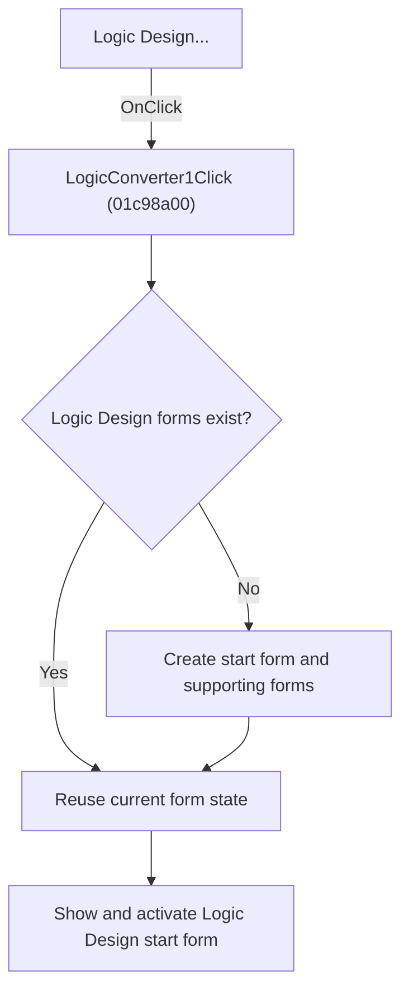

# Logic Design...

> Analysis status: Source, graph, and form evidence reviewed.

## Control

| Property | Recovered value |
| --- | --- |
| Form | SchematicEditor |
| Component path | SchematicEditor.MainMenu.mnTools.LogicConverter1 |
| Control class | TMenuItem |
| Caption | Logic Design... |
| Hint | Not present in the recovered resource. |
| Text | Not present in the recovered resource. |
| Handler name | LogicConverter1Click |
| Handler address | 01c98a00 |
| Graph node | `resource:dfm:SchematicEditor/SchematicEditor.MainMenu.mnTools.LogicConverter1` |
| Handler node | `function:01c98a00` |
| Graph layer | UI |

## What happens when clicked

The command opens the Logic Design workflow. On the first click, it creates the Logic Design form and nine supporting forms that the workflow uses. It stores each form in its shared application slot. It then shows and activates the `introduction_form`, whose recovered caption is `Logic Design`. Later clicks reuse the existing forms and keep their current state.

The handler does not select a logic function, clear the forms, or run a conversion. It only makes sure that the workflow forms exist and opens the Logic Design start form.

## Click flow

## Handler evidence

- Source: [DecompiledSources/Tina16/functions/0000000001C98A00__FUN_01c98a00.c](../../../DecompiledSources/Tina16/functions/0000000001C98A00__FUN_01c98a00.c)
- Recovered role: Opens the singleton Logic Design workflow and creates its forms on demand.
- Current graph summary: Creates missing Logic Design workflow forms and shows the recovered `introduction_form` start form.
- Current graph behavior: Tests ten shared form pointers, constructs only the missing objects, and calls the annotated VCL show-and-activate helper for the main Logic Design form.
- Current graph evidence: `FUN_01c98a00` allocates the form class at `PTR_FUN_01b2adc8` into `PTR_DAT_02003af0` and shows that exact pointer. Recovered events place `introduction_form` in this class range, and its DFM caption is `Logic Design`. The adjacent class at `PTR_FUN_01b2a450` maps to `Function_wind_form`, confirming that these are the Logic Design form group.
- Complexity: moderate
- Distinct outgoing calls: 2

## Direct calls

- `function:007fc180` — FUN_007fc180
- `function:008059a0` — FUN_008059a0

## Resource evidence

- Kind: Not present in the recovered resource.
- Modal result: Not present in the recovered resource.
- Checked state: Not present in the recovered resource.
- List items: Not present in the recovered resource.
- Image reference: Not present in the recovered resource.
- Extracted glyph: None.

## Nearby label candidates

Nearby labels are layout candidates only. They are not proof of behavior.

- No same-parent label candidate is available.

## Analysis limits

- Delphi names for the nine supporting global form slots are not all recovered. Their creation is proven, but this article does not assign an unsupported name to each slot.
- The handler has no error branch when form construction fails.

