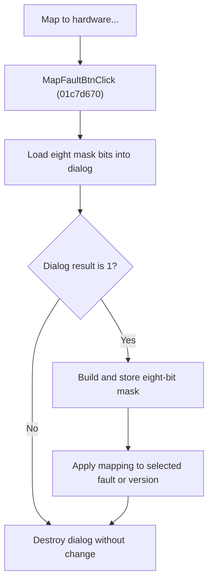

# Map to hardware...

> Analysis status: Reviewed from recovered source and dialog call paths.

## Control

| Property | Recovered value |
| --- | --- |
| Component path | SchematicEditor.EditorPanel.FaultManager.GroupBox4.FaultPanel.MapFaultBtn |
| Control class | TBitBtn |
| Caption | Map to hardware... |
| Handler | MapFaultBtnClick at 01c7d670 |

## What happens when clicked

The handler creates the hardware-mapping dialog and initializes its eight check boxes from the current version's bit mask at record offset `0x0c`. If the dialog returns modal result `1`, it reads the eight check boxes, rebuilds the mask, writes it to the current version, and applies the mask to the selected fault or current version. Cancel closes the dialog without changing the mask. The dialog is destroyed on both paths.

## Click flow

## Handler evidence

- Source: [FUN_01c7d670](../../../DecompiledSources/Tina16/functions/0000000001C7D670__FUN_01c7d670.c)
- [FUN_01b719f0](../../../DecompiledSources/Tina16/functions/0000000001B719F0__FUN_01b719f0.c) maps bits `0` through `7` to the dialog controls.
- [FUN_01b71a50](../../../DecompiledSources/Tina16/functions/0000000001B71A50__FUN_01b71a50.c) reconstructs the eight-bit value after acceptance.
- [FUN_01c77ab0](../../../DecompiledSources/Tina16/functions/0000000001C77AB0__FUN_01c77ab0.c) chooses the selected fault when the fault UI is active; otherwise it uses the current version and forwards the mask to the hardware-mapping operation.

## No-op and error behavior

- Cancel: the current mapping mask stays unchanged.
- The recovered handler has no separate failure dialog.
