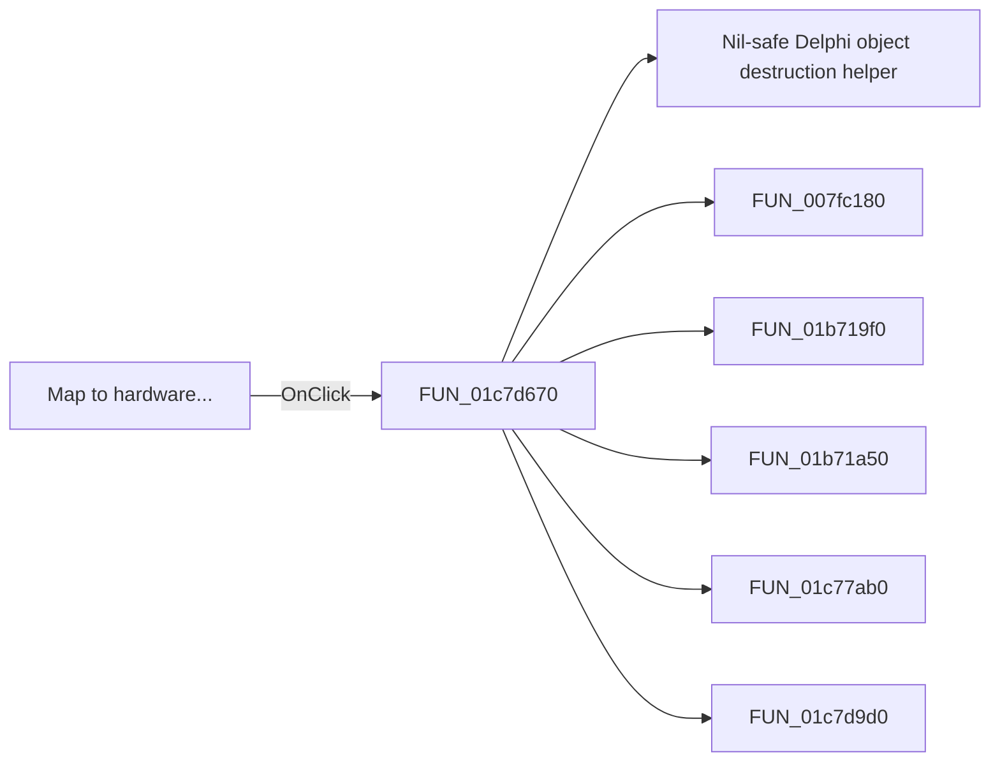

# Map to hardware...

> Analysis status: Pending individual source review.

## Control

| Property | Recovered value |
| --- | --- |
| Form | SchematicEditor |
| Component path | SchematicEditor.EditorPanel.FaultManager.GroupBox4.FaultPanel.MapFaultBtn |
| Control class | TBitBtn |
| Caption | Map to hardware... |
| Hint | Not present in the recovered resource. |
| Text | Not present in the recovered resource. |
| Handler name | MapFaultBtnClick |
| Handler address | 01c7d670 |
| Graph node | `resource:dfm:SchematicEditor/SchematicEditor.EditorPanel.FaultManager.GroupBox4.FaultPanel.MapFaultBtn` |
| Handler node | `function:01c7d670` |
| Graph layer | UI |

## What happens when clicked

Pending individual analysis. An agent must read the recovered handler source and its relevant callees before it replaces this text.

## Click flow

## Handler evidence

- Source: [DecompiledSources/Tina16/functions/0000000001C7D670__FUN_01c7d670.c](../../../DecompiledSources/Tina16/functions/0000000001C7D670__FUN_01c7d670.c)
- Recovered role: Not present in the recovered resource.
- Current graph summary: Handles 1 Delphi UI event: SchematicEditor.EditorPanel.FaultManager.GroupBox4.FaultPanel.MapFaultBtn.OnClick.
- Current graph behavior: Not present in the recovered resource.
- Current graph evidence: Not present in the recovered resource.
- Complexity: complex
- Distinct outgoing calls: 6

## Direct calls

- `function:00410f20` — Nil-safe Delphi object destruction helper
- `function:007fc180` — FUN_007fc180
- `function:01b719f0` — FUN_01b719f0
- `function:01b71a50` — FUN_01b71a50
- `function:01c77ab0` — FUN_01c77ab0
- `function:01c7d9d0` — FUN_01c7d9d0

## Resource evidence

- Kind: Not present in the recovered resource.
- Modal result: Not present in the recovered resource.
- Checked state: Not present in the recovered resource.
- List items: Not present in the recovered resource.
- Image reference: Not present in the recovered resource.
- Extracted glyph: None.

## Nearby label candidates

Nearby labels are layout candidates only. They are not proof of behavior.

- No same-parent label candidate is available.

## Analysis limits

- Do not infer behavior from the control class, caption, hint, glyph, or nearby label alone.
- Do not replace the pending status until the handler source and relevant call path provide enough evidence.
