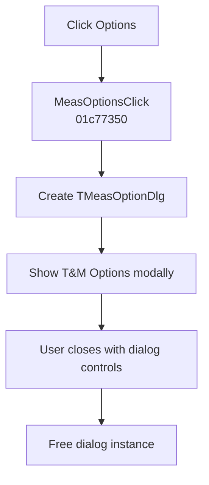

# &Options...

> Analysis status: Evidence-backed source review complete.

## Control

| Property | Recovered value |
| --- | --- |
| Form | SchematicEditor |
| Component path | SchematicEditor.MainMenu.mnTM.MeasOptions |
| Control class | TMenuItem |
| Caption | &Options... |
| Hint | Not present in the recovered resource. |
| Text | Not present in the recovered resource. |
| Handler name | MeasOptionsClick |
| Handler address | 01c77350 |
| Graph node | `resource:dfm:SchematicEditor/SchematicEditor.MainMenu.mnTM.MeasOptions` |
| Handler node | `function:01c77350` |
| Graph layer | UI |

## What happens when clicked

`MeasOptionsClick` constructs a form from VMT `01b709e8`. Manual read-only VMT inspection identifies this class as `TMeasOptionDlg`. The handler shows the form modally through virtual slot `+0x2d0` and frees it after the modal call returns.

The recovered DFM identifies the dialog caption as **T&M Options**. It contains **Generator matching** and **Disable Hardware** check boxes, an **HW Setup...** button, and built-in OK, Cancel, and Help buttons. The click handler does not inspect the modal result and does not perform another state update after the dialog closes. Any option validation or persistence occurs inside the dialog and is outside this handler path.

## Click flow

## Handler evidence

- Source: [DecompiledSources/Tina16/functions/0000000001C77350__FUN_01c77350.c](../../../DecompiledSources/Tina16/functions/0000000001C77350__FUN_01c77350.c)
- Recovered role: Show the modal T&M Options dialog and free it when it closes.
- Current graph summary: Handles 1 Delphi UI event: SchematicEditor.MainMenu.mnTM.MeasOptions.OnClick.
- Current graph behavior: Creates `TMeasOptionDlg`, shows it modally, and destroys it after the modal call returns.
- Current graph evidence: The handler constructs VMT `01b709e8`, invokes virtual slot `+0x2d0`, and calls the nil-safe object destructor. Manual VMT inspection identifies `TMeasOptionDlg`; its DFM supplies the T&M Options caption and its controls.
- Complexity: moderate
- Distinct outgoing calls: 2

## Direct calls

- `function:00410f20` — Nil-safe Delphi object destruction helper
- `function:007fc180` — FUN_007fc180
- Modal target resource [`MeasOptionDlg`](../measoptiondlg/README.md) — recovered T&M Options form and controls.

## Resource evidence

- Kind: Not present in the recovered resource.
- Modal result: Not present in the recovered resource.
- Checked state: Not present in the recovered resource.
- List items: Not present in the recovered resource.
- Image reference: Not present in the recovered resource.
- Extracted glyph: None.

## Nearby label candidates

Nearby labels are layout candidates only. They are not proof of behavior.

- No same-parent label candidate is available.

## Analysis limits

- The handler does not read the modal result. The internal code that loads, validates, or saves the dialog fields is not part of this click path.

