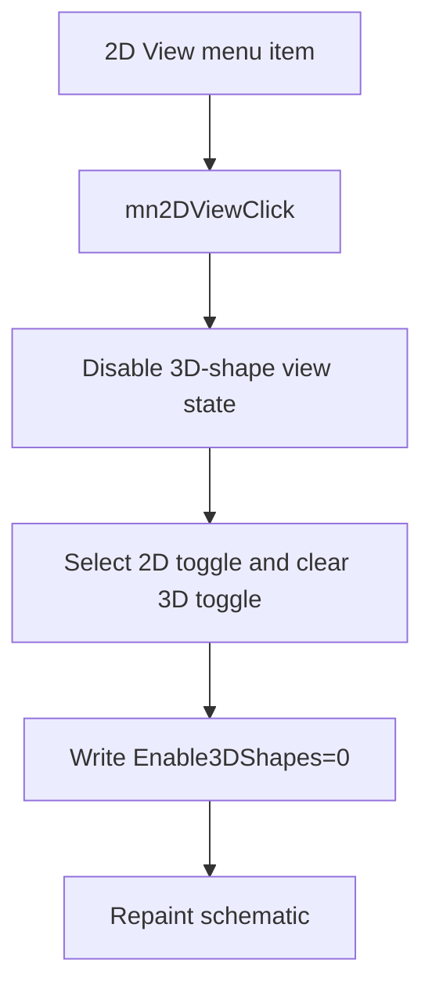

# 2D View

> Analysis status: Reviewed with recovered view-state and persistence evidence.

## Control

| Property | Recovered value |
| --- | --- |
| Component path | `SchematicEditor.MainMenu.View.mn2DView` |
| Control class | `TMenuItem` |
| Handler | `mn2DViewClick` at `01c9b040` |

## What happens when clicked

The command requests the disabled state for 3D shapes on the active view. The common synchronization path reads the resulting state, selects the 2D toggle, clears the 3D toggle, writes `Enable3DShapes=0` in the `Schematic Editor` section of `TINA.INI`, and repaints the schematic.

## Click flow

## Evidence

- [Handler source](../../../DecompiledSources/Tina16/functions/0000000001C9B040__FUN_01c9b040.c) requests state `0` and calls the common synchronization path.
- [View-state setter](../../../DecompiledSources/Tina16/functions/000000000082A6C0__FUN_0082a6c0.c) applies the requested state and updates the view.
- [Synchronization path](../../../DecompiledSources/Tina16/functions/0000000001C99100__FUN_01c99100.c) updates both toggles, persists `Enable3DShapes`, and repaints.

## Analysis limits

- The recovered code does not identify the renderer implementation behind the view state.
