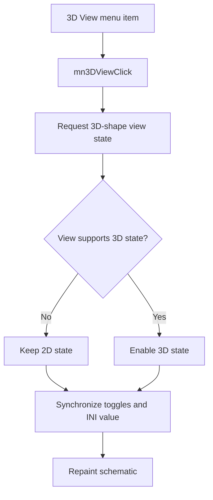

# 3D View

> Analysis status: Reviewed with recovered view-state and persistence evidence.

## Control

| Property | Recovered value |
| --- | --- |
| Component path | `SchematicEditor.MainMenu.View.mn3DView` |
| Control class | `TMenuItem` |
| Handler | `mn3DViewClick` at `01c9b010` |

## What happens when clicked

The command requests the enabled state for 3D shapes on the active view. A view that does not support this state forces the result back to 2D. The common synchronization path reads the actual result, updates the 2D and 3D toggles, writes that result to `Enable3DShapes` in the `Schematic Editor` section of `TINA.INI`, and repaints the schematic.

## Click flow

## Evidence

- [Handler source](../../../DecompiledSources/Tina16/functions/0000000001C9B010__FUN_01c9b010.c) requests state `1` and calls the common synchronization path.
- [View-state setter](../../../DecompiledSources/Tina16/functions/000000000082A6C0__FUN_0082a6c0.c) rejects the enabled state when the view does not support it.
- [Synchronization path](../../../DecompiledSources/Tina16/functions/0000000001C99100__FUN_01c99100.c) updates both toggles, persists the actual state, and repaints.

## Analysis limits

- The recovered code does not identify the renderer implementation behind the view state.
